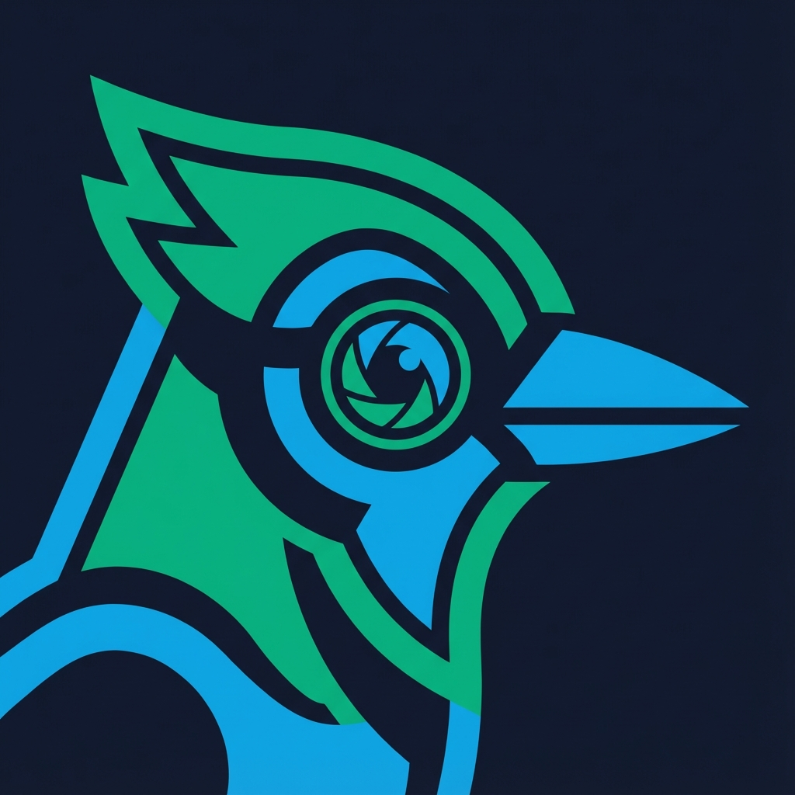
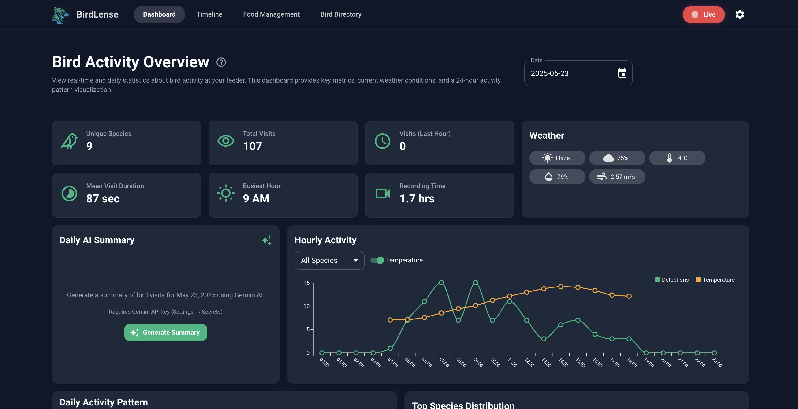
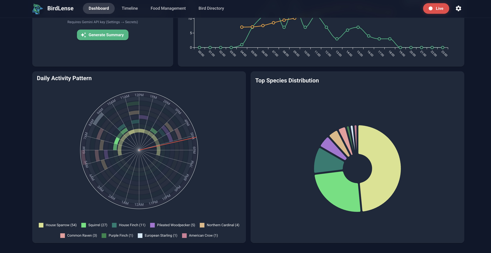
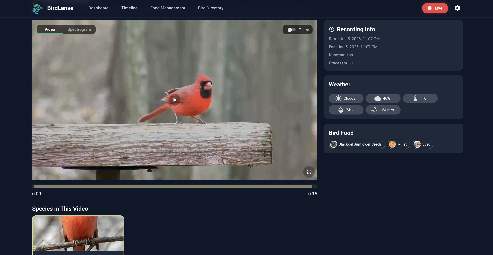

<p align="center">
  
</p>

# BirdLense Hub

[](./CHANGELOG.md) [Русский](./README.ru.md) · [Contributing](./CONTRIBUTING.md) [RU](./CONTRIBUTING.ru.md) · [Security](./SECURITY.md) [RU](./SECURITY.ru.md)

### Short description

Canonical one-liners for **GitHub About**, mirrors, and press: **[SHORT_DESCRIPTION.md](./SHORT_DESCRIPTION.md)** · **[SHORT_DESCRIPTION.ru.md](./SHORT_DESCRIPTION.ru.md)**

Smart bird feeder monitoring: computer vision and audio recognition to detect, identify, record, and analyze birds. Runs in Docker on x86, integrates with Go2RTC, Frigate, BirdNET via MQTT. No cloud — fully local.

**Docs:** [Project overview](./docs/OVERVIEW.md) · [Full documentation index](./docs/README.md) · [Documentation site (Pages)](https://gfermoto.github.io/BirdLense-Hub/)

**Community:** [Discussions](https://github.com/Gfermoto/BirdLense-Hub/discussions) · [Issues](https://github.com/Gfermoto/BirdLense-Hub/issues)

### Model info

Two components: **detector** (bird/squirrel in frame) and **classifier** (bird species).

| Component | Version | Trained on | Note |
|-----------|---------|------------|------|
| **Detector** | YOLOv8n | NABirds + COCO birds + OIDv4 squirrel | Binary bird/squirrel — unchanged in EU training |
| **Classifier** | YOLOv8n-cls / YOLO11n-cls | NABirds (≈400) or birds-525 + iNaturalist (≈490) | US or EU |

**Current model:** EU (birds-525 + iNaturalist Europe, ~491 species). US (NABirds) — backup in `best_US.pt`.

**EU model:** classifier trained on merged_cls → [gfermoto/birds-eu-merged](https://huggingface.co/datasets/gfermoto/birds-eu-merged). Weights: [gfermoto/birdlense-birds-eu](https://huggingface.co/gfermoto/birdlense-birds-eu). Training: [docs/TRAINING.md](./docs/TRAINING.md). Detector unchanged.

**Catalog hygiene:** align the Hub species list with your classifier using `species.catalog_allowlist_file` + optional `catalog_strict_ingest`, `scripts/datasets/dump_classifier_allowlist.py`, and `POST /api/ui/system/species-catalog/reconcile` — see [docs/CONFIGURATION.md](./docs/CONFIGURATION.md).

<details>
<summary>📷 Screenshots</summary>
<br>
<p align="center">
  
</p>
<p align="center">
  
</p>
<p align="center">
  
</p>
</details>

## Features

### Core
- **Live video** — streaming from IP cameras via [Go2RTC](https://github.com/AlexxIT/Go2RTC), real-time detection overlays
- **Bird detection** — custom YOLO + ByteTrack tracking, two-stage strategy (binary detector + species classifier)
- **Audio** — [BirdNET](https://github.com/kahst/BirdNET-Analyzer) sightings via MQTT (BirdNET-Pi/Go)
- **Triggers** — OpenCV motion, Frigate events, MQTT binary, ESPHome
- **Timeline** — date + time-of-day filter (Morning, Day, Evening, Night 22–06), video playback, spectrograms, track visualization
- **UI** — React 19, Material UI, i18n (en/ru), mobile-friendly, PWA (install prompt, offline cache)
- **Weather** — OpenWeather or Home Assistant
- **Notifications** — Telegram Bot API
- **MCP** — optional wire protocol for external clients (see `docs/MCP_SETUP.md`)

### Analytics & Export
- **CSV/JSON export** — download visits for analysis in Excel/Python
- **eBird export** — checklist format for import into eBird.org
- **Region comparison** — compare your species with eBird region top (Overview card)
- **PDF report** — monthly summary: species count, top-5, charts
- **Prometheus metrics** — `/metrics` for Grafana dashboards

### Citizen Science
- **iNaturalist** — one-click export: download crop from video, open inaturalist.org/observations/upload
- **Unknowns** — low-confidence detections for manual review; date + time-of-day filter (like Timeline)

### Integrations
- **Webhook** — POST on each detection (IFTTT, Zapier)
- **Bird song player** — Xeno-canto recordings on species page
- **Confidence per species** — lower threshold for rare birds
- **Research** — dataset collection, model fine-tuning (see [docs](./docs))

## Quick Start

**Docker (free image):**
```bash
docker pull ghcr.io/gfermoto/birdlense-hub:latest
# or use docker-compose — see docs/INSTALL.md
```
UI: http://localhost:8085

**Full install:** [docs/INSTALL.md](./docs/INSTALL.md) | **Scenarios:** [docs/SCENARIOS.md](./docs/SCENARIOS.md) | **All docs:** [docs/README.md](./docs/README.md) | **Features:** [docs/FEATURES.md](./docs/FEATURES.md)

On first run, `make setup` creates `app/.env` with `PROCESSOR_SECRET` and `FLASK_SECRET_KEY` automatically.

## Developers

- **Local setup:** [docs/LOCAL_DEV.md](./docs/LOCAL_DEV.md) — Docker, **Node.js 22** for `app/ui` (see `app/ui/.nvmrc` and `package.json` `engines`), MkDocs venv vs app Python.
- **Tests & CI:** [docs/TESTING.md](./docs/TESTING.md) — `make test`, `make test-web`, E2E; processor tests are RAM-heavy.
- **Contributing:** [CONTRIBUTING.md](./CONTRIBUTING.md).

## Requirements

- **Docker** — x86/amd64
- **Go2RTC** — video streams (standalone or in Frigate), e.g. `http://YOUR_HOST:1984`
- **MQTT** (optional) — Frigate events, BirdNET sightings

## Structure

| Path | Description |
|------|-------------|
| [app/](./app) | Application (UI, API, processor) — single container |
| [docs/](./docs) | Architecture, config, API, deployment, MCP |
| [scripts/](./scripts) | Deploy, restore-config, datasets, verification |

## Commands

From repo root:

| Command | Description |
|---------|-------------|
| `make deploy` | Deploy to server (requires `scripts/deploy.local.sh`) |
| `make build` | Build Docker image |
| `make start` | Start container |
| `make stop` | Stop container |
| `make logs` | View logs |

From `app/`:

| Command | Description |
|---------|-------------|
| `make pull` | Pull and run pre-built image |
| `make setup` | Create `.env` with secrets (runs automatically) |

## Configuration

- **Settings** → Video: Go2RTC URL (`http://IP:1984`)
- **Settings** → Cameras: stream names from Go2RTC
- **Settings** → MQTT: broker for Frigate/BirdNET
- Config file: `app/app_config/user_config.yaml`

## Security

For production, set in `app/.env` (or via `deploy.local.sh` when deploying):

| Variable | Purpose |
|----------|---------|
| `FLASK_SECRET_KEY` | Flask session (settings protection) |
| `PROCESSOR_SECRET` | Processor API protection (`X-Processor-Token` header) |
| `BIRDLENSE_ENV` | `production` — strict secret validation |

Secrets are auto-generated on first `make start` or `make pull`. See `app/.env.example`. Deploy script writes them to server `app/.env`.

## License

See [LICENSE](LICENSE). Docker image: CC BY-NC-ND 4.0 for non-commercial use.

## Acknowledgments

- [BirdLense](https://github.com/AleksandrRogachev94/BirdLense) by Aleksandr Rogachev — inspired the creation of this project
- [Ultralytics YOLO](https://github.com/ultralytics/ultralytics)
- [BirdNET-Analyzer](https://github.com/kahst/BirdNET-Analyzer)
- [NABirds](https://dl.allaboutbirds.org/nabirds), [COCO](https://cocodataset.org/), [Open Images](https://storage.googleapis.com/openimages/web/index.html) (OIDv4 squirrel) — detector
- [34data/birds-525-species](https://huggingface.co/datasets/34data/birds-525-species), [iNaturalist](https://www.inaturalist.org/) (Europe) — classifier (merged)
- [Material-UI](https://mui.com/)
- [OpenWeatherMap](https://openweathermap.org/)
