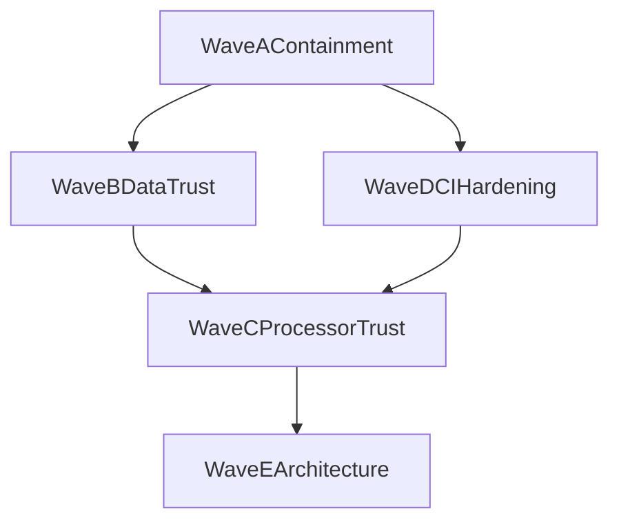

# Консилиум: аудит (RU, архив заметок)

Дата: `2026-03-30`. Не дублирует актуальный [ROADMAP.ru.md](./ROADMAP.ru.md) — это снимок обсуждения для истории.

*Уточнение путей (2026-04): закрыт [#198](https://github.com/Gfermoto/BirdLense-Hub/issues/198) — публичные маршруты вида разнесены по `ui_*_routes`; ниже для summary указан актуальный файл.*

## Большой консилиум BirdLense Hub

Этот документ фиксирует findings-first аудит BirdLense Hub по направлениям:
- доверие к `species` данным и карточкам видов;
- startup side-effects и self-healing логика;
- доверие к processor pipeline;
- web/ui, CI/E2E и deploy reliability.

## Executive Summary
Утрата доверия к системе вызвана не одним багом, а комбинацией архитектурных проблем:

1. В каталог видов может попадать недостоверная семантика.
Причина: цепочка `raw label -> Species -> external enrichment` допускает запись нерелевантных изображений и описаний без жесткой валидации таксона.

2. Приложение делает слишком много изменяющих действий на старте.
Причина: `create_app()` не только поднимает веб, но и мутирует БД, запускает cleanup/repair и может инициировать внешние сетевые операции.

3. Processor pipeline допускает правдоподобные, но неверные результаты.
Причина: слабые quality gates, опасные merge-эвристики, режимы детекции с не-птичьими классами и confidence logic, ориентированная на прохождение, а не на доказуемость.

4. Пользовательские регрессии слишком легко доходят до прода.
Причина: PR-защита сосредоточена на build и части API-тестов, но не на обязательных browser-level сценариях критичных страниц.

Ниже findings упорядочены по severity, затем приведены стартовые операции с verdict, матрица user-facing маршрутов и волны ремонта.

## Critical Findings

### C1. Недостоверные species-карточки являются системным дефектом data pipeline
Симптомы уровня заказчика:
- в карточках видов появляются `миска`, `нож`, `цветок`, `женщина`, `туалет`, `Unknown`;
- внешне карточка выглядит заполненной, но семантически не соответствует птице.

Корневая причина:
- `Species` может создаваться из сырого имени, которое не прошло строгий canonical resolve;
- затем enrichment в [app/web/util.py](../app/web/util.py) подбирает внешние данные по строковому поиску в Wikipedia/iNaturalist;
- при отсутствии жесткой taxon-level валидации система принимает «похожий» внешний результат как истину.

Основные точки риска:
- [app/web/services/visit_processor.py](../app/web/services/visit_processor.py)
- [app/web/services/species_registry_service.py](../app/web/services/species_registry_service.py)
- [app/web/util.py](../app/web/util.py)
- [ui_species_media_routes.py](../app/web/routes/ui_species_media_routes.py) (карточка вида / summary / медиа); оркестратор [ui_routes.py](../app/web/routes/ui_routes.py)

Почему это критично:
- каталог видов становится недостоверным даже без падения API;
- заказчик видит уверенно оформленную, но ложную карточку;
- ошибка выглядит не как «баг отображения», а как подмена фактов.

### C2. `create_app()` выполняет опасные data mutations и recovery-операции
Корневая причина:
- `create_app()` вызывает [app/web/app_startup.py](../app/web/app_startup.py): `seed`, registry backfill, cleanup, background repair и опциональный enrich (код вынесен из `app.py` для ясности; поведение то же).

Почему это критично:
- рестарт приложения меняет данные;
- отладка инцидентов становится нетривиальной: невозможно быстро ответить, «что изменил последний рестарт»;
- любое ошибочное условие cleanup/repair становится destructive path на каждом запуске.

### C3. Processor pipeline не доказывает корректность видов до записи в БД
Корневая причина:
- в [app/processor/src/detection_strategy.py](../app/processor/src/detection_strategy.py), [app/processor/src/species_normalizer.py](../app/processor/src/species_normalizer.py), [app/processor/src/decision_maker.py](../app/processor/src/decision_maker.py) используются эвристики, которые делают результат правдоподобным, но не обязательно истинным.

Ключевые риски:
- single-stage COCO может пропускать не только птиц;
- MQTT merge может усиливать или подменять вид по временным/приоритетным эвристикам;
- confidence и voting легко дают «достаточно хороший» ответ без реального semantic gate.

Почему это критично:
- downstream web уже работает с данными как с фактом;
- ложная species assignment дальше загрязняет каталог, визиты, summary и датасеты.

## High Findings

### H1. Read-path `/species/:id/summary` имеет write side-effect
В [ui_species_media_routes.py](../app/web/routes/ui_species_media_routes.py) эндпоинт summary может инициировать enrichment и `commit`.

Риск:
- обычное открытие карточки способно менять БД;
- поведение страницы зависит от состояния кэша и внешних источников;
- read API перестает быть безопасным и воспроизводимым.

### H2. В системе нет единого источника истины для species mapping
Сейчас сосуществуют:
- processor-side mapping;
- registry aliases;
- seeded hierarchy;
- live-created `Species` rows;
- manual/override logic в enrichment.

Риск:
- дубликаты видов;
- разные имена для одного таксона;
- несогласованность между processor и web.

### H3. Startup notifications и startup repair остаются частью критического пути
В [app/web/notifications.py](../app/web/notifications.py), [app/web/app_startup.py](../app/web/app_startup.py) и конце `create_app` в [app/web/app.py](../app/web/app.py) старт всё ещё содержит внешние или фоновые side-effects.

Риск:
- непредсказуемый cold start;
- усложненная эксплуатация;
- ложное ощущение «self-healing», когда система фактически скрывает корневой дефект.

### H4. E2E не является обязательным gate перед поставкой
См.:
- [.github/workflows/e2e-scheduled.yml](../.github/workflows/e2e-scheduled.yml)
- [.github/workflows/ci-pr.yml](../.github/workflows/ci-pr.yml)
- [.github/workflows/deploy.yml](../.github/workflows/deploy.yml)

Риск:
- браузерные регрессии могут проходить PR и проявляться только после деплоя;
- критичные страницы не имеют гарантированного smoke на каждый merge.

## Medium Findings

### M1. Startup cleanup и repair операции недостаточно отделены от migrations
Даже если каждая отдельная операция задумывалась как safe-repeat, их совместное выполнение внутри `create_app()` затрудняет reasoning и аудит.

### M2. Контрактные и API-тесты не покрывают весь user-facing surface
Особенно недозащищены:
- video details;
- timeline при грязных данных;
- migration в реальных UI ветках;
- species summary/data-quality paths.

### M3. Система использует `metadata_status`, но не имеет trust model
Нужны отдельные понятия:
- `verified`;
- `best_effort`;
- `suspect`;
- `quarantined`;
- `operator_confirmed`.

Без этого поле `ok` означает только «что-то найдено», а не «данным можно доверять».

### M4. Некоторые merge/repair flows плохо наблюдаемы
Нехватает:
- отдельных audit logs;
- операционных счетчиков;
- dry-run/report режима;
- явного operator acknowledgement для risk-bearing jobs.

## Наблюдения по конкретным пользовательским примерам

Примеры:
- `species/816` — миска
- `species/815` — нож
- `species/447` — цветок вместо жаворонка
- `species/745` — неизвестный
- `species/48` — рыжая женщина

Это не пять несвязанных инцидентов, а минимум четыре класса дефектов:

1. `Raw label contamination`
   в БД попадает имя, которое не прошло строгий canonical gate.

2. `Wrong external enrichment`
   строка резолвится во внешний объект, который не соответствует птице.

3. `Hierarchy/alias drift`
   один и тот же логический вид может жить в нескольких row/alias формах.

4. `Unknown and bucket leakage`
   служебные или umbrella entries ведут себя как обычные species cards.

## Verdict по startup операциям

| Операция | Файл | Verdict |
|---|---|---|
| `db.create_all()` и schema-safe `ALTER` | [app/web/app_startup.py](../app/web/app_startup.py) | `allowed` |
| `seed()` и базовая иерархия | [app/web/app_startup.py](../app/web/app_startup.py) | `allowed` |
| `ensure_species_registry_seeded()` | [app/web/app_startup.py](../app/web/app_startup.py) | `gated` |
| `backfill_species_taxa(dry_run=False)` | [app/web/app_startup.py](../app/web/app_startup.py) | `forbidden on startup` |
| `cleanup_legacy_import_placeholders()` | [app/web/app_startup.py](../app/web/app_startup.py) | `gated` |
| `repair_recently_reset_species_metadata()` thread | [app/web/app_startup.py](../app/web/app_startup.py) | `forbidden on startup` |
| `SPECIES_METADATA_ENRICH_ON_START` thread | [app/web/app_startup.py](../app/web/app_startup.py) | `forbidden on startup` |
| `notify_app_startup()` | [app/web/app.py](../app/web/app.py) | `gated` |
| system metrics sampler | [app/web/routes/ui_system_routes.py](../app/web/routes/ui_system_routes.py) | `allowed` |

Правило:
- старт приложения должен поднимать веб;
- heavy maintenance jobs должны запускаться явно;
- destructive или external side-effects на старте должны быть opt-in, а не default.

## Critical Routes vs Protection

| Маршрут / сценарий | Текущая защита | Gap |
|---|---|---|
| species catalog / species summary | частичный pytest, нет trust validation | нет semantic/data-quality gates |
| video details | частичный backend pytest | нет обязательного PR browser smoke |
| timeline | backend tests есть, browser protection слабая | нет обязательного smoke после deploy |
| migration | часть pytest + условный E2E | E2E может skip при бедной БД |
| unknowns | backend tests есть | слабая защита от деградации UI/slow paths |
| startup / deploy | health check | health не доказывает корректность пользовательских сценариев |

## Главные корневые причины

### 1. Смешение read, write и repair обязанностей
Один и тот же runtime-path:
- обслуживает пользователя;
- лечит данные;
- обогащает metadata;
- меняет registry state.

### 2. Best-effort эвристики там, где нужна доказуемость
Система старается «заполнить карточку» вместо того, чтобы честно признать `unverified`.

### 3. Неединый canonical pipeline
Processor, web registry, aliases, hierarchy и enrichment не образуют один жесткий contract.

### 4. Слабая PR-level защита браузерных и data-quality инцидентов
API и build страхуются лучше, чем реальный UX и доверие к данным.

## Волны ремонта

### Wave A: Containment
Цель: остановить дальнейшее загрязнение и неожиданную мутацию данных.

Шаги:
- запретить dangerous startup jobs по умолчанию;
- убрать write-side-effects из read API;
- ввести quarantine для suspect species metadata;
- добавить быстрый PR smoke на критичные маршруты.

### Wave B: Data Trust Restoration
Цель: восстановить доверие к каталогу видов.

Шаги:
- ввести trust model для `Species` metadata;
- построить bulk audit существующих species rows;
- отделить verified vs best-effort vs quarantined metadata;
- добавить operator workflow для сомнительных карточек.

### Wave C: Processor Trust and Quality Gates
Цель: перестать писать в web/db неподтвержденные «факты».

Шаги:
- ужесточить bird-only guarantees;
- пересмотреть merge с MQTT и `Bird` handoff;
- улучшить confidence/voting semantics;
- добавить pre-write semantic gates.

### Wave D: CI / E2E Hardening
Цель: чтобы тяжелые user-facing регрессии не доезжали до прода.

Шаги:
- сделать узкий E2E обязательным на PR;
- добавить `eslint`/UI checks в CI;
- расширить OpenAPI/API smoke для critical endpoints;
- добавить post-deploy smoke кроме `/health`.

### Wave E: Architectural Cleanup
Цель: снизить сложность и сделать систему предсказуемой.

Шаги:
- декомпозировать processor и startup logic;
- развести maintenance jobs и request-serving code;
- сделать maintenance flows наблюдаемыми, dry-run friendly и идемпотентными.

## Рекомендуемый порядок исполнения

## Консилиум 2026-04-10: регрессия «Применить» на странице видео (PATCH детекции)

**Симптом:** после смены дефолта `apply_scope` на `single_track` для PATCH без тела запрос с `source: video` без поля `apply_scope` обновлял только одну строку `VideoSpecies`, тогда как прежняя семантика UI видео — fanout по тому же старому виду на всём ролике (`legacy_fanout`).

**Вердикт:** дефолт должен зависеть от `source`: `video` → `legacy_fanout`, иначе (Unknowns / прочее) → `single_track`. Явная передача `apply_scope` с клиента по-прежнему имеет приоритет.

**Изменения:** [ui_corrections_dataset_routes.py](../app/web/routes/ui_corrections_dataset_routes.py) (`update_detection_species`); тест `test_patch_video_source_defaults_legacy_fanout` в [test_api.py](../app/web/tests/test_api.py). На UI ([DetectedSpecies.tsx](../app/ui/src/pages/VideoDetails/DetectedSpecies.tsx)): числовое значение Select (MUI отдаёт string), явный успех после одной правки, сообщение об ошибке из тела API, защита от «тихого» выхода без `detection id`.

## Консилиум 2026-04-10: сумерки / ИК — ложные виды YOLO без «зажима мыши»

**Вводные оператора:** включён **light gate** (требование яркости/контраста в UI); глобально поднимать `min_confidence_*` не хочется — пропадут чувствительные срабатывания на **мышь/грызунов** (мелкий объект, слабый сигнал).

### Участники (роли)

| Роль | Фокус |
|------|--------|
| **CV/ML** | калибровка, домен ИК/ночи, разделение ошибок детектора и классификатора |
| **Системная архитектура** | где в pipeline разрешать компромисс «чувствительность vs точность вида» |
| **Продукт / доверие данных** | что показывать пользователю и в уведомлениях при неуверенности |
| **Полевой наблюдатель** | мышь и «птичий» шум на кормушке — разные сценарии, одна камера |

### Диагноз по текущему коду (факты)

1. **Light gate** ([`light_level_detector.py`](../app/processor/src/light_level_detector.py), [`frame_processor.py`](../app/processor/src/frame_processor.py)): даунсэмпл кадра → средняя яркость + **std как контраст**; при провале кадр **не идёт в YOLO** (cooldown 1 с). Это фильтр *до* бинарного детектора, одинаковый для всех классов.
2. **Один порог на бинарный проход:** `min_confidence_binary` применяется ко **всем** боксам ([`frame_processor.py`](../app/processor/src/frame_processor.py) L83–84); в [`detection_strategy.py`](../app/processor/src/detection_strategy.py) `is_valid_detection` не различает Bird vs Squirrel.
3. **После детектора** [`decision_maker.py`](../app/processor/src/decision_maker.py) уже **асимметричен**: для видов с `rodent|squirrel|chipmunk|sciurus` в имени — **более мягкий** порог классификатора (`_get_threshold_for_species`); для голого **Bird** — жёстче (`_promotable_generic_bird`: площадь bbox, число кадров, `best_frame_score`). То есть «не резать мышь глобальным порогом» частично уже заложено на **уровне решения по виду**, но не на **уровне появления ложной рамки «птица»** и не на **тонкой таксономии** (ложный «дрозд» при шуме).
4. **Классификатор (EU/US)** на ИК-кадрах объективно смещён: мало данных ночного домена → рост ложных fine-grained меток при том же detector conf.

**Вывод:** проблема — не только «порог», а **несовпадение домена** (день/ИК) и **одна скалярная политика** на весь two-stage путь. Глобальный tighten действительно бьёт по грызунам; нужна **раздельная политика по типу объекта и по качеству сцены**.

### Ресерч (сжато, industry + академия)

- **Per-class / per-task thresholds** в детекции и двухстадийных системах — стандартный приём, когда классы имеют разный prior и cost of miss (FROC по классам).
- **Confidence calibration** (temperature scaling, Platt) на валидационном сете с **ночными** кадрами — снижает «уверенные» ложные виды без изменения архитектуры модели.
- **Temporal consistency / hysteresis:** требование согласованности метки на **K из N** кадров трека резко режет случайные перескоки вида при шуме (video domain).
- **Reject option / «unknown» head** (см. open-set recognition): явный выход «не уверен» лучше, чем выдуманный вид; для продукта — связка с `review_only` / отложенным уточнением.
- **Domain adaptation / ночной fine-tune** на собственных кропах с метками оператора — единственный путь к устойчивому качеству без вечного подкручивания эвристик.

### Вердикт консилиума: изящные направления (по убыванию «системность / эффект»)

1. **Сцена + класс детектора в decision layer (рекомендовано как ядро)**  
   Пробрасывать в трек/решение **скаляры качества сцены** (хотя бы `mean_brightness`, `contrast_std` с того же пути, что light gate, или флаг «прошёл порог с запасом / на грани»). При **низком контрасте**:
   - для итоговой **тонкой таксономии птиц** — повышать требуемый `combined` или переводить в **`review_only` / Unknown** с сохранением визита для датасета;
   - для **Squirrel/Rodent**, подтверждённых бинарником, — **не ужесточать** тот же множитель (уже отделены пороги в `_get_threshold_for_species` и fallback-ветки).  
   Это **не костыль «один слайдер»**, а явная модель: *достоверность вида зависит от условий съёмки*.

2. **Раздельные пороги бинарного детектора Bird vs Squirrel/Rodent**  
   Расширение конфига и [`detection_strategy.py`](../app/processor/src/detection_strategy.py): разные `min_conf` в зависимости от `detector_label` после первого прохода (или два порога на фильтрацию до трекера). Позволяет **резать ночной шум именно в классе Bird**, оставляя чувствительность на грызунов. Требует аккуратной валидации на ваших весах.

3. **Стабилизация вида по треку (temporal voting)**  
   Не фиксировать финальный `species_name` с первого сильного кадра; требовать **устойчивого большинства** по классификатору на окне трека (или экспоненциальное сглаживание по logits). Уменьшает «мигание» редких видов в сумерках.

4. **Отложенная таксономия (deferred refinement)**  
   Визит сохранять с низкой доверия меткой уровня **Bird / Unknown**, лучший кроп — в очередь на **повторную классификацию** при дневном эталоне или второй лёгкой модели. Уведомления — по более строгому каналу. Прозрачно для оператора, не ломает охват.

5. **Данные и дообучение (среднесрок)**  
   Выгрузка ночных false/true в [dataset pipeline](../docs/CONFIGURATION.ru.md) + калибровка / partial fine-tune классификатора на ИК. Это **единственное** решение без потолка по качеству на дистанции.

### Явные анти-паттерны (костыли)

- Один глобальный рост `min_confidence_binary` / `min_confidence_to_process` «на ночь» без разделения классов — **противоречит** цели не терять мышь.
- Полное отключение классификатора без замены политики хранения/уведомлений — загрязнение каталога и датасета generic-метками.
- Игнорирование Frigate/BirdNET в сумерках: если они подмешивают вид, править нужно **fusion** и их пороги отдельно ([`detection` в user_config](../app/app_config/user_config.yaml): `cross_source_confidence_bonus`, standalone-пороги).

### Следующие шаги (инженерные, приоритет)

1. Спецификация: JSON-поля **scene_quality** на треке + правила в `DecisionMaker` только для **птиц** и fine-grained accept.  
2. POC: два значения `min_confidence_binary` (bird vs non-bird) + регрессионные тесты на [`test_decision_maker.py`](../app/processor/tests/test_decision_maker.py) / интеграция.  
3. Сбор ночного набора для калибровки и измерения **ECE** по классификатору на ИК.

## Минимальные immediate actions

1. Заморозить все необязательные startup repair/enrich paths.
2. Убрать запись в БД из `/species/:id/summary`.
3. Ввести `suspect/quarantined` статус для species cards.
4. Обязать PR-level browser smoke хотя бы для `species`, `video`, `timeline`, `migration`.
5. Подготовить разовый bulk report по уже загрязненным species rows.

## Вывод
BirdLense сейчас страдает не от отсутствия логики, а от избытка неразделённых эвристик и self-healing поведения в чувствительных местах. Система слишком охотно превращает «похоже» в «истину» и слишком легко мутирует данные в runtime. Главный приоритет — сначала вернуть доказуемость и предсказуемость, а уже затем продолжать feature work.
