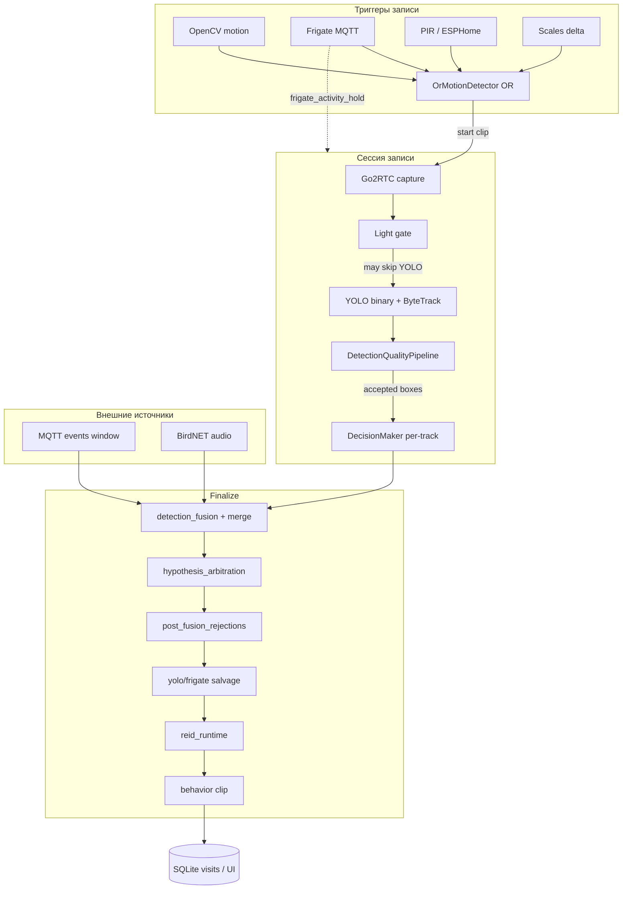
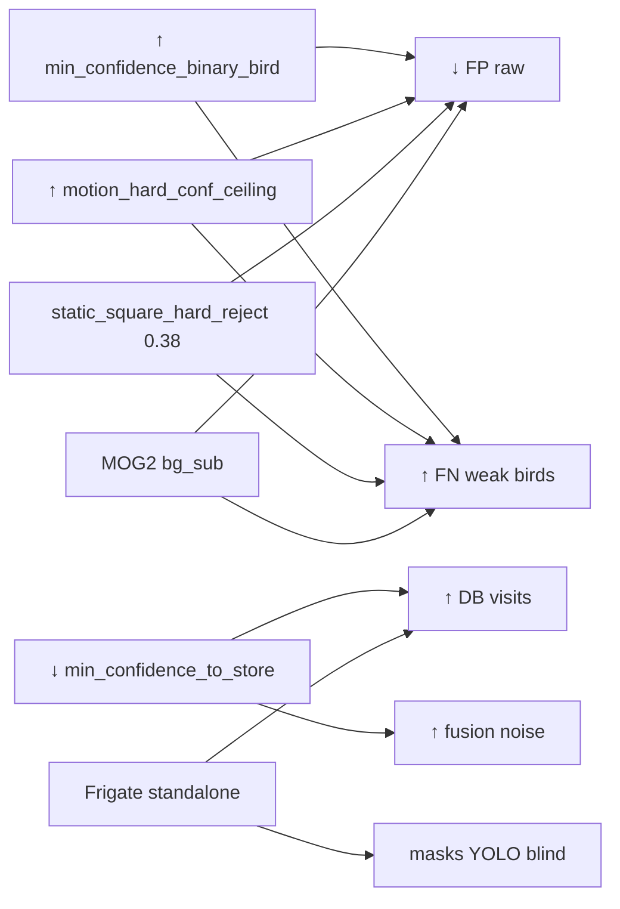
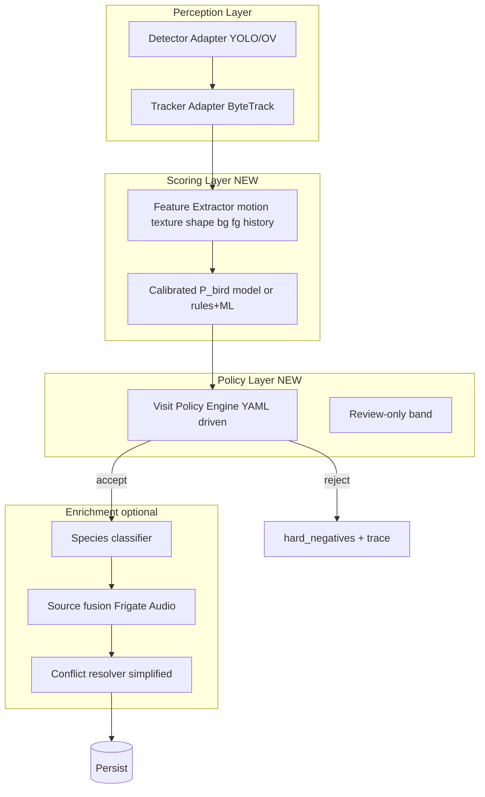

# SOTA Deep Dive Audit — Архитектурный разлом (2026-05-20)

**Роль документа:** Chief Architect / System Auditor  
**Статус:** CRITICAL PAUSE — хотфиксы остановлены до утверждения SOTA 2.0  
**Аудитория:** CTO, Lead ML, DevOps  
**Связанные артефакты:** [Issues](https://github.com/Gfermoto/BirdLense-Hub/issues), [Roadmap Project #2](https://github.com/users/Gfermoto/projects/2), [`SOTA_BASELINE_2026_Q2.md`](SOTA_BASELINE_2026_Q2.md), [`SOTA_WAVE3_ROADMAP_2026.md`](SOTA_WAVE3_ROADMAP_2026.md)

---

## Executive summary

BirdLense Hub **не сломан как детектор** — сломан **контракт принятия решений**. Инцидент 2026-05-20 показал: при `yolo_raw_boxes_total` **478** и `yolo_accepted_boxes_total` **0** OpenVINO NABirds продолжал инференс; отказ давали **пост-детекционные фильтры** (`global_frame_static`, static square reject), а не модель. Параллельно **Frigate/MQTT** продлевал сессии и создавал визиты без YOLO — система выглядела «живой», но **без локализации BirdLense**.

**Корневая причина кругов:** десятки независимых порогов и фильтров без единой функции достоверности, без автокалибровки и без замкнутого цикла обучения на ошибках. Каждый хотфикс FP сдвигает FN; каждый bypass FN открывает FP.

**Решение:** не «ещё один фильтр», а **SOTA 2.0** — единый Decision Engine, обязательный Golden Set gate, Black Box trace на каждый кадр/трек, модульные границы (detect → score → policy → persist).

---

## Этап 1 — Тотальный аудит пайплайна (End-to-End)

### 1.1 Карта системы (точки отказа)



| # | Узел | Файлы | Метрика / симптом отказа |
|---|------|-------|---------------------------|
| T1 | OR-триггеры | `motion_detectors/or_motion.py`, `mqtt_aggregator.py` | Дубли клипов; потеря trigger при burst (queue 256) |
| T2 | Cooldown | `processor_bootstrap.py` | `min_seconds_between_recordings` vs requeue |
| T3 | Frigate hold | `recording_session.py` | `session_extended_by_frigate_only` при `yolo_frames_with_tracks=0` |
| T4 | Light gate | `frame_processor.py` | `low_light_blocked_frames` — YOLO off, Frigate hold on |
| D1 | YOLO infer | `detection_strategy.py` | `yolo_raw_boxes` — до quality |
| D2 | Track conf mismatch | ByteTrack YAML vs `track(conf)` | WARNING: boxes but no track ids |
| D3 | Quality stack | `detection_quality.py`, `scene_adaptive.py`, `static_object_filter.py` | **raw>0, accepted=0** (инцидент) |
| D4 | Per-track gate | `decision_maker.py` | `min_track_duration`, generic bird gates |
| F1 | Store floor | `detection_fusion.py` | `min_confidence_to_store` отсекает после accept |
| F2 | Frigate standalone | `detection_fusion.py` | Визит без YOLO при `blind_yolo` |
| F3 | Arbitration | `hypothesis_arbitration.py` | Hardcoded 0.82/0.12 → generic Bird |
| F4 | Salvage restore | `recording_finalize.py` | Частичный откат reject |

### 1.2 Входной поток (триггеры)

**Как стартует запись:** `OrMotionDetector` — первый из `{opencv, frigate, motion_sensor, scales}` с `detect()==True` → `MotionRecordingSession.run()`.

**Конфликты с YOLO (доказанные):**

| Сценарий | Поведение | SOTA-проблема |
|----------|-----------|---------------|
| Frigate trigger, YOLO «молчит» (accepted=0) | `frigate_activity_hold_seconds` держит `has_detections=True` | **Маскировка слепоты** — клип идёт, метрики «сессия активна» |
| Frigate finalize, 0 YOLO tracks | `frigate_standalone_when_no_yolo` + arbitration | Визит **без bbox BirdLense** — внешний детектор подменяет ядро |
| OpenCV + Frigate на одной сцене | Два клипа подряд | Cooldown/requeue, не единая политика «один визит» |
| `label_exclude` в Frigate | Merge suppressed, **trigger всё равно** | Рассинхрон trigger vs species merge |

**Почему полагаемся на внешние триггеры, если цель — SOTA детектор?**

Исторически: Frigate даёт **ранний старт записи** и **species hint** при слабом бинарнике. Архитектурно это превратилось в **костыль primary path**, когда YOLO blind. Для SOTA 2.0: Frigate = **входной сенсор записи**, не **источник истины о виде**; истина — только fused row с provenance и минимальным `detector_conf` от нашего bbox.

### 1.3 Ядро детекции (YOLO + OpenVINO)

**Инцидент 2026-05-20 13:05 UTC (после «nuclear» FP-патча):**

```
recording_session_summary:
  yolo_frames_with_raw_boxes: 100
  yolo_raw_boxes_total: 478
  yolo_accepted_boxes_total: 0
  yolo_frames_with_tracks: 0
  yolo_blind_suspected: false
```

```
DetectionQuality reject track=1 conf=0.363 reason=global_frame_static(mean_absdiff=0.00)
```

**Вывод:** модель **видела** объекты; **global_frame_static** при `motion_hard_conf_ceiling=0.55` убивал всё с `conf < 0.55` на статичном RTSP (mean_absdiff≈0). Дополнительно `static_square_hard_reject_max_conf=0.38` резал квадратные боксы ~0.36 без «anchor» в кадре.

**После emergency recovery + code fix (trust floor):**

| session_id | raw | accepted | tracks |
|------------|-----|----------|--------|
| 1706 | 227 | **176** | **130** |
| 1707 | 4371 | **92** | **91** |

**Граница «шум vs слабая птица» (сейчас не формализована):**

| Сигнал | Сейчас | Проблема |
|--------|--------|----------|
| YOLO conf 0.28–0.45 | Проходит binary floor | Может быть ветка/блик/компрессия |
| mean_absdiff≈0 | global static reject | **Режет реальную птицу** на статичном потоке |
| MOG2 fg_ratio < 0.07 | bg_sub reject | Птица на фоне кормушки = фон для MOG2 |
| aspect≈1.0, conf<0.38 | static square hard reject | Дальние птицы часто компактны |

**Отсутствует:** калибровка P(real bird | features) на Golden Set — только цепочка AND-фильтров.

### 1.4 Трекинг (ByteTrack)

- `track(conf)` часто **0.05–0.28** (OpenVINO cap), пороги ByteTrack **0.02 ниже** — при рассинхроне: «6 boxes, no track ids».
- IoU fallback live (`iou_id_fallback_live_enabled`) спасает id, но **не спасает accepted**, если quality режет после.
- `yolo_frames_with_tracks` = `len(results)>0` после всего пайплайна — **не** «есть ByteTrack id».

### 1.5 Логика слияния (Fusion & Arbitration)

**Порядок (упрощённо):**

1. `DecisionMaker.get_decisions()` → accepted/rejected **tracks**
2. `build_fused_video_detections()` → Frigate standalone (если blind / no species)
3. `merge_detections()` + BirdNET + multi-cam
4. `apply_hypothesis_arbitration()` — поглощение generic↔species, clip-level dedup
5. Filter `>= detection.min_confidence_to_store`
6. Finalize salvages (yolo core anchor, weak yolo, frigate trigger review)

**Когда YOLO молчит, но визит есть — фича или костыль?**

| Режим | Оценка |
|-------|--------|
| Frigate standalone при **подтверждённом** blind + MQTT score | **Костыль выживания**, не SOTA |
| Arbitration → generic **Bird** | **Деградация продукта** — пользователь видит «птица», не вид |
| Trigger review salvage | **Операционный аудит**, не detection |

**Новые точки отказа:** 4 слоя после detect с **разными порогами**; `hypothesis_arbitration.py` — константы **вне YAML**; `min_confidence_to_store (0.35) > min_confidence_to_process (0.20)` — нарушение инварианта (`app_config.py` предупреждает, но прод жил с этим).

### 1.6 Классификация и поведение

**Поток кропа:** bbox → letterbox map → blur gate → (optional SR) → YOLO-cls → `combined_conf = det × cls`.

**Почему Unknown / Bird:**

| Причина | Механизм |
|---------|----------|
| Нет кропа | blur, classify budget, `bird_skip_classifier_max_area_frac` |
| regional_species filter пуст | → Unknown |
| Слабый cls | fallback_bird / review_only_generic_bird |
| YOLO blind | Frigate species → arbitration downgrade → **Bird** |

**Связь с фильтрами:** если quality обнулила accepted, классификатор **не вызывается** на live-пути; вид в БД приходит **только** из Frigate/arbitration.

**Behavior / ReID:** работают **после** fusion на `best_frame` — изолированы от качества детекции; ReID не чинит species; behavior не чинит FP bbox.

### 1.7 ReID и профили

- `reid_runtime.py` — embedding на fused detection, SQLite gallery.
- **Не участвует** в accept/reject на кадре.
- **Нет** сквозного `bird_identity` → visit в UI как «знакомая птица» (Wave 3 #480).
- При `accepted=0` ReID не получает качественный crop.

---

## Этап 2 — Системные противоречия (почему бегаем кругами)

### 2.1 Карта зависимостей порогов



| Изменение X | Метрика Y ломается | Пример инцидента |
|-------------|-------------------|------------------|
| Nuclear FP: bird conf 0.32 + motion strict | `yolo_accepted → 0` | 2026-05-20 12:55–13:10 |
| Salvage off | Нет weak-bird recovery | Требует повторного включения |
| `openvino_binary_bird_score_scale: 8.5` (legacy) | FP ×10 | Wave 1 BRG |
| Night profile conf 0.22 | FP ночью | truth_serum |
| `min_confidence_to_store` 0.08 на проде | Тысячи визитов | deploy не трогает user_config |

### 2.2 Магические числа (требуют обоснования или удаления)

| Параметр | Значение | Где | Риск |
|----------|----------|-----|------|
| `motion_hard_conf_ceiling` | 0.55 | detection_quality | Выше bird floor → режет 0.28–0.54 |
| `motion_global_max_mean_absdiff` | 2.0 | detection_quality | RTSP compression → 0.0 |
| `static_scene_bird_min_confidence` | 0.5 (legacy default) | static_object_filter | Anchor недостижим при bird 0.32 |
| `static_square_hard_reject_max_conf` | 0.38 | static_object_filter | Режет 0.36 «птицу» |
| `bg_min_foreground_ratio` | 0.07 | scene_adaptive | MOG2 на кормушке |
| `ARBITRATION_SCORE_GAP` | 0.12 | hypothesis_arbitration | Не в YAML |
| `generic_bird_min_detector_conf` | max(store, 0.45) | decision_maker | Выше binary bird |
| `ultra_weak_box_salvage_min_confidence` | 0.005 | detection_strategy | Противоречит precision-first |

### 2.3 Отсутствие обратной связи

| Есть | Нет |
|------|-----|
| `hard_negatives/` при reject | Weekly retrain → deploy (#479 открыт) |
| `session_runtime_metrics` | Непрерывный mAP / per-reason ROC |
| `decision_trace` на finalize | **Per-frame** why rejected (Black Box) |
| Golden manifests (частично) | **CI gate**: deploy blocked if anchor recall ↓ |

### 2.4 Противоречия компонентов (конкретные)

1. **DetectionQuality vs DetectionStrategy:** комментарий «post-track must not discard» — далее `filter_boxes` отсекает tracked boxes.
2. **auto_small_object_relax:** default True в strategy, False в quality → `relaxed_small_object_blocked`.
3. **Метрики:** `yolo_raw` считается успехом инференса; оператор думает «YOLO шумит» при `accepted=0`.
4. **Baseline отчёт «17× FP↓»** vs сессии 10:00–11:25 `accepted≈raw` — **метрика окна**, не продукт ([truth_serum](reports/truth_serum_fp_crisis_20260520.md)).
5. **Wave 3 (#482 masks)** vs универсальный MOG2 — два конкурирующих UX для одной задачи FP.

---

## Этап 3 — Стратегия SOTA 2.0 (Holistic Architecture)

### 3.1 Принципы

1. **Один источник истины на визит** — fused row с обязательным `provenance[]` (yolo | frigate | audio).
2. **Детектор предлагает, Policy решает** — никаких 8 фильтров с независимыми порогами без скоринга.
3. **Слабый сигнал ≠ автоматический reject** — только низкий score + optional review-only.
4. **Калибровка на старте потока** — 30–60 с «Auto-Calibration Mode» (фон, exposure, motion baseline).
5. **Замкнутый цикл данных** — FP/FN → hard negatives → retrain → parity → canary.

### 3.2 Целевая архитектура



**Единый скоринг (замена каскада фильтров):**

```
score = w_det * logit(conf_det)
      + w_motion * f(roi_absdiff, track_stability)
      + w_bg * f(mog2_fg_in_box)
      + w_shape * f(aspect, area_norm)
      - w_static * g(persistent_geometry)

accept_frame  iff score >= τ_accept(session_profile)
review_only   iff τ_review <= score < τ_accept
reject        iff score < τ_review → hard_negative
```

`τ_accept`, `τ_review` — из **Auto-Calibration** (перцентили на пустом кадре 30 с), не ручной YAML на VPS.

### 3.3 Модульность (границы интерфейсов)

| Модуль | Вход | Выход | Не знает о |
|--------|------|-------|------------|
| DetectorAdapter | frame BGR | List[DetectionProposal] | species, Frigate |
| TrackerAdapter | proposals | TrackState[] | fusion |
| ScoringEngine | TrackState, frame context | ScoreBreakdown | SQLite |
| VisitPolicy | ScoreBreakdown, config | Accept/Reject/Review | OpenVINO paths |
| FusionEnricher | Accepted tracks, MQTT | VisitHypothesis[] | MOG2 internals |

### 3.4 Роль внешних систем в SOTA 2.0

| Система | SOTA 2.0 роль |
|---------|----------------|
| Frigate | Trigger + **prior** (boost score, не replace bbox) |
| OpenCV motion | Trigger only |
| BirdNET | Audio prior в enrich |
| Frigate standalone | **Deprecated** как default; только `emergency_mode` flag |

---

## Этап 4 — План действий (не хотфиксы)

### 4.1 Стоп-кран (немедленно)

| Действие | Статус |
|----------|--------|
| Заморозка хотфиксов порогов на проде | ✅ balanced patch + trust-floor deploy 2026-05-20 |
| Git tag `baseline-v1.0-stable-2026-05-20` | ✅ существует |
| Tag `audit-pause-2026-05-20` после утверждения документа | Рекомендуется |
| Wave 3 feature work (#479–#482) | **PAUSED** до Phase 0 |

### 4.2 Phase 0 — Observability & Golden Gate (4–6 недель)

| ID | Deliverable | Критерий готовности |
|----|-------------|---------------------|
| 0.1 | **Per-frame Black Box** — расширить quality stats → JSONL `decision_frame_trace` | 100% reject с `reason_code` + features |
| 0.2 | **Golden Set v2** — 20 клипов: пустая кормушка, птица, рассвет, ветер, ночь | manifest в repo, CI |
| 0.3 | **CI gate** `make validate-pipeline-golden` — raw/accepted/recall/FPR | deploy blocked if bird recall < 98% anchors |
| 0.4 | **Threshold Contract** doc + lint — один YAML раздел `policy.bird` | нет `store < process` |
| 0.5 | Dashboard: raw vs accepted vs reject reasons | Grafana/UI |

### 4.3 Phase 1 — Scoring Engine (6–8 недель)

| ID | Deliverable |
|----|-------------|
| 1.1 | `ScoringEngine` class — заменить 5+ фильтров в `DetectionQualityPipeline` |
| 1.2 | Auto-Calibration на старте сессии |
| 1.3 | Frigate as prior only — feature flag `fusion.frigate_requires_yolo_bbox` default true |
| 1.4 | Удалить hardcoded arbitration constants → policy YAML |

### 4.4 Phase 2 — Active Learning Loop (параллельно #479)

См. Wave 3 §1 — но **после** Golden Gate, не до.

### 4.5 Phase 3 — Wave 3 UX/Edge (после Phase 1 green)

#481 INT8, #482 mask editor (optional layer, **не** primary FP), #480 ReID profiles.

### 4.6 Валидация (обязательная для каждого PR)

```bash
make validate-pipeline-golden   # будущая цель
make validate-nabirds-ov-parity
# Offline: scripts/compare_detector_bboxes.py на golden clips
```

**Запрет:** оценка «тишины на пустой кормушке» как единственный KPI без bird anchor recall.

---

## Этап 5 — Консолидация Issues & Roadmap

### 5.1 Текущие open issues ([репозиторий](https://github.com/Gfermoto/BirdLense-Hub/issues))

| Issue | Заголовок | Milestone | Действие после аудита |
|-------|-----------|-----------|------------------------|
| [#479](https://github.com/Gfermoto/BirdLense-Hub/issues/479) | Active Learning hard negatives | SOTA Wave 3 | **Перепривязать** к SOTA 2.0 Phase 2; blocked by Phase 0 Golden Gate |
| [#480](https://github.com/Gfermoto/BirdLense-Hub/issues/480) | ReID profiles + behavior | SOTA Wave 3 | Phase 3; depends on stable bbox path |
| [#481](https://github.com/Gfermoto/BirdLense-Hub/issues/481) | INT8 + multi-camera | SOTA Wave 3 | Phase 3; после parity gate |
| [#482](https://github.com/Gfermoto/BirdLense-Hub/issues/482) | Mask editor + smart alerts | SOTA Wave 3 | **Downgrade P0→P2**; masks optional, scoring primary |
| [#451](https://github.com/Gfermoto/BirdLense-Hub/issues/451) | BirdBox tuning LOW_CONFIDENCE | — | **Merge** в Phase 0.4 Threshold Contract + Auto-Calibration |
| [#376](https://github.com/Gfermoto/BirdLense-Hub/issues/376) | ESPHome radar trigger | — | Без изменений (trigger layer) |
| [#350](https://github.com/Gfermoto/BirdLense-Hub/issues/350) | NAS storage | post-release | Без изменений |
| [#243](https://github.com/Gfermoto/BirdLense-Hub/issues/243) | Scale field test | P3 | Без изменений |

### 5.2 Рекомендуемые новые issues (создать вручную)

| Предлагаемый title | Milestone | Phase |
|--------------------|-----------|-------|
| **[SOTA 2.0] Phase 0: Per-frame Black Box + decision trace** | SOTA 2.0 Foundation | 0.1 |
| **[SOTA 2.0] Phase 0: Golden Set v2 + CI deploy gate** | SOTA 2.0 Foundation | 0.2–0.3 |
| **[SOTA 2.0] Phase 1: ScoringEngine replaces filter cascade** | SOTA 2.0 Foundation | 1.1 |
| **[SOTA 2.0] Phase 1: Frigate prior-only; deprecate standalone default** | SOTA 2.0 Foundation | 1.3 |
| **[SOTA 2.0] Phase 0: Threshold contract lint (store≥process)** | SOTA 2.0 Foundation | 0.4 |

### 5.3 GitHub Project [#2 Roadmap](https://github.com/users/Gfermoto/projects/2)

**Предлагаемая структура колонок:**

1. **CRITICAL PAUSE** — этот аудит, стоп хотфиксов  
2. **SOTA 2.0 Foundation (P0)** — Phase 0–1  
3. **SOTA Wave 3 (P1)** — #479–#482 после зелёного Golden Gate  
4. **Reliability / Infra** — #451, #376, #350, #243  

### 5.4 Обновление docs (этот PR)

| Документ | Изменение |
|----------|-----------|
| `docs/strategy/SOTA_DEEP_DIVE_AUDIT_2026.md` | **Этот файл** |
| `docs/strategy/SOTA_WAVE3_ROADMAP_2026.md` | PAUSED + dependency on SOTA 2.0 |
| `docs/strategy/SOTA_BASELINE_2026_Q2.md` | Caveat: baseline metrics не учитывают FN-инцидент 13:05 |
| `docs/reports/truth_serum_fp_crisis_20260520.md` | Ссылка на trust-floor fix |

---

## Приложение A — Хронология инцидента 2026-05-20

| UTC | Событие | raw | accepted |
|-----|---------|-----|----------|
| 08:23 | До quality, prod user_config мягкий | 1113 | 1110 |
| 08:35–11:25 | Частичные фильтры | сотни | ≈raw |
| 11:58+ | Quality pipeline deploy | 1500+ | 0 (пустая кормушка) |
| 12:55–13:10 | Nuclear FP patch | 100–500 | **0** + global_static |
| 13:15+ | Recovery + trust-floor code | 227+ | **176** |

## Приложение B — Кодовые якоря post-mortem fix

- `detection_quality.py`: `conf >= trust_floor` → skip global_static / roi_motion / texture / bg_sub  
- `static_object_filter.py`: defaults from `min_confidence_binary_bird`  
- `scripts/patch_prod_recovery_user_config.py` — emergency  
- `scripts/patch_prod_nuclear_user_config.py` — balanced (не legacy nuclear)

---

*Владелец: Chief AI Architect. Следующий пересмотр: после Phase 0.2 Golden Set v2 в CI. Утверждение стратегии — gate для снятия CRITICAL PAUSE.*
