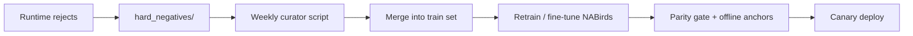

# SOTA Wave 3 — Advanced AI & Automation (2026 H2)

**Старт:** после фиксации [`SOTA_BASELINE_2026_Q2.md`](SOTA_BASELINE_2026_Q2.md) (v1.0 Stable).  
**Принцип:** не «чинить», а **превосходить** — измеримый прирост от baseline, без возврата хаоса версий.

> **CRITICAL PAUSE (2026-05-20):** Wave 3 **заморожен** до завершения [**SOTA 2.0 Foundation**](SOTA_DEEP_DIVE_AUDIT_2026.md) Phase 0 (Golden Set CI gate + Black Box + Threshold Contract). Инцидент `raw>>0, accepted=0` показал: новые фичи (#479–#482) не устраняют архитектурный разлом фильтров.

---

## Цели Wave 3

| Направление | KPI (от baseline v1.0) |
|-------------|-------------------------|
| Active Learning | Еженедельный цикл hard negatives → retrain без ручного rsync |
| Advanced Analytics | ReID-профили + behavior beyond single label |
| Edge Performance | INT8 binary −20% latency, 2+ камеры @ target FPS |
| UX Excellence | Mask editor в UI, smart alerts |

---

## 1. Active Learning Loop

**Текущее:** `processor.hard_negatives_enabled` → `app/data/hard_negatives/`.

**Целевое:**

| Задача | Deliverable | Приоритет |
|--------|-------------|-----------|
| 3.1.1 | `scripts/hard_negatives_curate.py` — дедуп, метки reason, cap/size | P0 |
| 3.1.2 | Manifest `datasets/hard_negatives_v1/` + doc в `docs/ml/` | P0 |
| 3.1.3 | Cron/Makefile `make retrain-negatives-weekly` (dry-run default) | P1 |
| 3.1.4 | Gate: не деплоить без `validate_ov_parity` + anchor rolики | P0 |

**Success:** FP rate на пустой кормушке ↓ 2× за 4 недели при стабильном bird recall.

---

## 2. Advanced Analytics

### 2.1 ReID — глобальные профили птиц

| Задача | Deliverable | Приоритет |
|--------|-------------|-----------|
| 3.2.1 | Аудит `scripts/reid/` + схема `bird_identity` в БД | P1 |
| 3.2.2 | Связка visit ↔ embedding cluster (UI карточка «знакомая птица») | P2 |
| 3.2.3 | SSL daily cycle в CI smoke (уже в Dockerfile) | P1 |

### 2.2 Behavior — сложные сценарии

| Задача | Deliverable | Приоритет |
|--------|-------------|-----------|
| 3.2.4 | Расширить labels: feeding chick, aggression, bathing (dataset spec) | P2 |
| 3.2.5 | v2 dataset только после v1 prod metrics ≥ baseline | P3 |

**Success:** ≥80% precision на 3 behavior-классах на golden set.

---

## 3. Edge Optimization

| Задача | Deliverable | Приоритет |
|--------|-------------|-----------|
| 3.3.1 | `export_nabirds_to_openvino.py --precision int8` + parity report | P1 |
| 3.3.2 | Benchmark: latency, accepted count, anchor recall vs FP32 | P1 |
| 3.3.3 | Multi-camera load test (2× RTSP, FPS budget doc) | P2 |

**Success:** INT8 в проде при parity ≤5% и latency −15% минимум.

---

## 4. UX Excellence

| Задача | Deliverable | Приоритет |
|--------|-------------|-----------|
| 3.4.1 | UI: polygon mask editor → export `detection_ignore_masks` YAML | **P0** |
| 3.4.2 | Preview overlay rejected reasons (debug mode) | P2 |
| 3.4.3 | Smart notifications: rare species, first ReID match | P2 |
| 3.4.4 | Settings page: quality pipeline toggles без raw YAML | P1 |

**Success:** пользователь настраивает маску без SSH; время onboarding < 15 мин.

---

## 5. Governance (не повторить Wave 1–2)

- Любая смена весов → `make snapshot-detector-weights` + parity.
- Одна `behavior.active_video_model` в конфиге.
- PR checklist: anchor rolики + `session_runtime_metrics` snippet.
- Milestone **SOTA Wave 3** — только задачи с KPI; hotfix → отдельный patch release от baseline tag.

---

## 0. Prerequisite — SOTA 2.0 Foundation (блокер Wave 3)

См. [`SOTA_DEEP_DIVE_AUDIT_2026.md`](SOTA_DEEP_DIVE_AUDIT_2026.md). Минимум для разморозки Wave 3:

| Phase | Deliverable | Связь с issues |
|-------|-------------|----------------|
| 0.1 | Per-frame Black Box trace | новый epic (создать) |
| 0.2–0.3 | Golden Set v2 + `make validate-pipeline-golden` | #451 tuning → Auto-Calibration |
| 0.4 | Threshold contract (`store >= process`) | #451 |
| 1.1 | ScoringEngine вместо filter cascade | — |
| 1.3 | Frigate prior-only | reliability |

**Issues #479–#482:** не начинать P0-work до зелёного Golden Gate 7 дней на VPS.

---

## 6. Фазы и вехи

| Фаза | Срок (ориентир) | Фокус |
|------|-----------------|-------|
| **2.0** | Q2 2026 W4+ | Foundation (аудит Phase 0–1) — **сейчас** |
| **3.0** | Q3 2026 W1–W2 | Mask UI + hard negatives curator |
| **3.1** | Q3 2026 W1–W4 | Weekly retrain loop + INT8 study |
| **3.2** | Q3 2026 W5–W8 | ReID profiles MVP |
| **3.3** | Q4 2026 | Behavior v2 dataset + multi-cam |

**GitHub Milestone:** `SOTA Wave 3`  
**Baseline tag (рекомендация):** `baseline-v1.0-stable-2026-05-20` после финального deploy.

---

## 7. Зависимости

- Baseline задеплоен и замерен 7 дней prod metrics.
- `user_config` на VPS не содержит legacy openvino/0.08 override.
- CI: `make ci-local` + dockerfile script test green.

---

*Владелец roadmap: CTO / Lead Architect. Обновление — раз в спринт или при закрытии эпика.*
