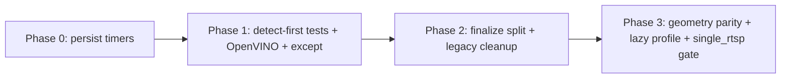

> **См. также:** [refactoring_consortium_plan.md](../refactoring_consortium_plan.md) · [EPIC #601 — Консилиум: архитектурная программа Hub](https://github.com/Gfermoto/BirdLense-Hub/issues/601)

# BirdLense Consortium — WAVE 1: Processor / Pipeline

**Дата:** 2026-06-10  
**Роль:** Processor/Pipeline specialist  
**Источник:** `simplification_optimization_proposal.md` + deep-read hot paths  
**Статус:** draft (без кода, без `gh issue create`)

---

## 0. Scope и инварианты (не ломать)

| Инвариант | Где закреплён | Суть |
|-----------|---------------|------|
| Dual-stream detect/main | `media_runtime.py`, `go2rtc_stream_source.py`, `default_config.yaml` | `detect_stream_name` обязателен; main = FFmpeg MP4, detect = motion/YOLO |
| Detect-first + raw-hits fallback | `detect_first.py`, `recording_session.py` | Gate до record; цепочка anchor → frigate-assist → raw-hits |
| Bbox remap detector→overlay→playback | `frame_geometry.py`, `detection_strategy._storage_bbox_norm_for_overlay`, `playback_geometry.py`, `dual_stream_timeline.py` | Letterbox unmap + scale к main; timeline offset на finalize |
| `single_rtsp_read: false` при recording | `default_config.yaml:184`, `go2rtc_stream_source._single_read_idle()` | При `recording=true` URL переключается на detect substream |
| OpenVINO paths + fallback | `detection_stack.py`, `inference/selector.py` | Validate IR; auto→torch fallback |
| go2rtc probe bootstrap | `media_runtime.setup_processor_media`, `stream_probe.py` | Block на missing `detect_stream_name`; per-camera record probe |

---

## 1. Критическая оценка claims proposal

### 1.1 LOC и масштаб — подтверждено / уточнено

| Claim | Proposal | Факт (2026-06-10) | Вердикт |
|-------|----------|-------------------|---------|
| `recording_finalize.py` | ~1842 | **1842** | ✓ |
| `recording_session.py` | ~1026 | **1026** | ✓ |
| `go2rtc_stream_source.py` | 941 | **941** | ✓ |
| `except Exception` в finalize | 21× | **21** | ✓ |
| `except Exception` в session | 13× | **13** | ✓ |
| `except Exception` в go2rtc | 10× | **10** | ✓ |
| Processor `except Exception` total | ~186 | **~183** (`review_report`: ~187) | ✓ |
| ~120 Python-модулей processor | ~120 | **~130** `.py` в `app/processor/src/` | ≈ (занижено на ~10) |
| `detection_strategy.py` | не в hotspots | **1956 LOC** — крупнейший модуль | **пропуск в proposal** |

**Вывод:** god-модули и broad-except — реальны. Proposal недооценивает `detection_strategy.py` (больше finalize по сложности surface API).

### 1.2 Perf bottlenecks — подтверждено

Источник: `docs/reports/perf/runtime_pipeline_profile_latest.md` (n=47, 24h).

| Стадия | p95 | Комментарий |
|--------|-----|-------------|
| `finalize_duration_ms` | **37.3 s** | Dominant; warn >8s |
| `persist_duration_ms` | **28.6 s** | **77%** critical path |
| `fusion_duration_ms` | 1.46 s (хвост до 37s coupled) | Иногда coupled с persist |
| `create_video_duration_ms` | 98 ms | OK |
| `trigger_to_first_bbox_wall_s` | 5.46 s | Warn 8s — на грани |

**Вывод:** proposal верно: не inference, не create_video — **finalize persist tail**.

### 1.3 Legacy pipeline — частично уже мёртвый код

- `processor.pipeline_mode: legacy` в `pipeline_mode_utils.is_linear_pipeline()` **уже трактуется как linear** с deprecation warning (#610).
- `default_config.yaml`: `pipeline_mode: linear`.
- Отдельно: `detection.persist_mode: legacy` → мапится на `binary_track_first` (`persist_mode.py`).
- В `recording_finalize.py` ветки `linear_skip_legacy_fusion_safeguards`, weak salvage, Frigate salvage **всё ещё активны** с условиями.

**Вывод:** удаление legacy — в основном **cleanup + тесты**, не смена runtime для prod с `linear`. Риск — случайно срезать safeguard-ветки (detect-first restore, weak salvage).

### 1.4 Single RTSP read — уже реализован, default off

- `processor.single_rtsp_read: false` в default.
- Idle: main stream + software lores (`_derive_detect_frame`).
- Recording: `_live_capture_url()` → detect substream (тест `test_recordingRtspFallback`).
- Prod drift: `.user_config_prod_drift.yaml` — `single_rtsp_read: false`.

**Вывод:** proposal #9 — не «отказ от dual-stream», а опциональный режим. **Включение в prod без Phase E geometry — риск.**

---

## 2. Refactoring proposals + regression guardrails

### 2.1 Декомпозиция finalize (proposal #1) — рекомендуется

**Сейчас:** монолит `finalize_motion_recording()` (~700+ LOC тела) + salvage/helpers.

**Целевые пакеты (behavior-preserving):**

```
recording_finalize/
  classify.py      # defer_classifier, enrich_tracks
  fusion_gate.py   # build_fused, post_fusion, track_first
  safeguards.py    # detect_first restore, weak/frigate salvage, yolo_core_anchor
  persist.py       # create_video, birdnet_fifo, dataset_crops, scales, behavior
  notify.py        # TG, preview chain
  metrics.py       # latency budgets, runtime_signals export
```

**Worker:** `recording_finalize_worker.py` (138 LOC) — **API не менять**; только import path.

**Guardrails:**

- Контракт `finalize_motion_recording(**kwargs)` без изменения сигнатуры.
- Порядок стадий: classify → decisions → mqtt → fusion → bbox contract → dual_stream_timeline → **detect_first restore** → dense restore → salvage → track_first → reid → persist.
- Метрики `finalize_*_duration_ms` — те же имена в `recording_context.runtime_signals`.

### 2.2 Persist tail profiling (proposal #3) — P0 perf

**Подозреваемые в persist block** (`recording_finalize.py` ~1281+):

- `api.create_video` ingest (visit processor, weather, commit)
- `birdnet_fifo_persist.py`
- `recording_dataset_crops.py`
- `finalize_classification.enrich_tracks_classifier_at_finalize` (если defer)
- `reid_runtime.enrich_runtime_reid_detections`
- `maybe_predict_video_behavior_bundle`

**Guardrails:** feature flags уже есть — не удалять, добавить **per-substage timers** в readiness breakdown.

### 2.3 Narrow `except Exception` (proposal #6)

**Приоритет файлов:** finalize (21) → session (13) → go2rtc (10) → mqtt_aggregator.

**Правило:** re-raise `MemoryError`, `OSError`, `KeyboardInterrupt`; логировать с `camera_id`/`session_id`; не глотать OpenVINO init fail.

**Guardrails:** счётчики `*_fail_total` не должны падать; CI: `make ci-local` + processor tests.

### 2.4 Legacy surface reduction (proposal #2)

**Безопасно удалить/упростить:**

- Dead branches где `is_linear_pipeline` всегда true и тест дублирует linear.
- Deprecation-only paths в `detection_quality` static gates (уже off при linear).

**Не трогать без golden clips:**

- `restore_detect_first_persist_rows`
- `linear_skip_frigate_salvage_paths` / weak salvage при `detect_first_confirmed`
- `dual_stream_timeline.apply_playback_timeline_offset_to_detections`

### 2.5 Geometry DRY (proposal §4.1) — осторожно

**Сейчас три слоя:**

- `frame_geometry.py` — letterbox, `remap_norm_bbox_for_crop`
- `yolo_geometry.py` — thin wrappers
- `playback_geometry.py` — `resolve_playback_shape_hw`, enrich на finalize
- `detection_strategy._storage_bbox_norm_for_overlay` — storage path

**Цель:** один public API в `frame_geometry`, но **не менять численные результаты** (IoU gate `letterbox_roundtrip_iou` ≥0.9).

**Guardrails:** `test_frame_geometry.py`, `test_playback_geometry.py`, `test_dual_stream_timeline.py`, `bbox_remap_mismatch_total` не растёт.

### 2.6 OpenVINO hardening (proposal #8)

Уже частично в `detection_stack.py` (path missing → fail / auto fallback).

**Добавить:** bootstrap-time validate в `processor_bootstrap.py`; gauge `inference_backend_effective`; не ломать deploy Intel override (`/dev/dri`).

### 2.7 Finalize worker tuning

`FinalizeWorker`: maxsize=2 default, enqueue timeout 1.5s.

**Проверить:** `recording_finalize_enqueue_full_total`, backpressure при saturate — session loop не блокируется (enqueue false → sync fallback в session? проверить ветку ~1014).

---

## 3. Draft GitHub Issues

### Issue 1 — Finalize decomposition (behavior-preserving)

| Поле | Значение |
|------|----------|
| **Title** | `processor: split recording_finalize.py into stage modules (no behavior change)` |
| **Labels** | `area:processor`, `type:refactor`, `wave1`, `risk:medium` |
| **Priority** | P1 |
| **Phase** | 2 |
| **Body** | Разбить `recording_finalize.py` (1842 LOC) на подмодули: classify, fusion_gate, safeguards, persist, notify, metrics. Публичная точка `finalize_motion_recording` и worker import остаются. Критерии — §4 Issue 1. |

### Issue 2 — Persist tail instrumentation

| Поле | Значение |
|------|----------|
| **Title** | `processor: per-substage persist timers + readiness breakdown` |
| **Labels** | `area:processor`, `type:perf`, `wave1`, `observability` |
| **Priority** | **P0** |
| **Phase** | 0–1 |
| **Body** | Разложить persist tail (birdnet fifo, dataset_crops, reid, behavior, create_video ingest) с таймерами. Экспорт в readiness/dashboard. Цель: локализовать 77% p95. |

### Issue 3 — Narrow except in P0 hot paths

| Поле | Значение |
|------|----------|
| **Title** | `processor: replace broad except Exception in finalize/session/go2rtc` |
| **Labels** | `area:processor`, `type:reliability`, `wave1` |
| **Priority** | P1 |
| **Phase** | 1 |
| **Body** | 21+13+10 broad except → typed handling + re-raise critical. Без изменения control flow успешного пути. |

### Issue 4 — Legacy pipeline_mode cleanup

| Поле | Значение |
|------|----------|
| **Title** | `processor: remove pipeline_mode=legacy branches after migration note` |
| **Labels** | `area:processor`, `type:cleanup`, `wave1`, `breaking:config` |
| **Priority** | P2 |
| **Phase** | 2 |
| **Body** | Удалить ветки, где legacy≡linear. Оставить warning migration в docs. `detection.persist_mode=legacy` — отдельный PR. |

### Issue 5 — OpenVINO bootstrap validation

| Поле | Значение |
|------|----------|
| **Title** | `processor: validate OpenVINO IR paths at bootstrap with metrics` |
| **Labels** | `area:processor`, `area:ml`, `type:reliability`, `wave1` |
| **Priority** | P1 |
| **Phase** | 1 |
| **Body** | Fail-fast при пустом `binary_openvino`; auto→torch counter; readiness поле `inference_backend_effective`. |

### Issue 6 — Dual-stream geometry parity (EPIC continuation)

| Поле | Значение |
|------|----------|
| **Title** | `processor: dual-stream bbox parity — frame_geometry single API` |
| **Labels** | `area:processor`, `type:correctness`, `epic:dual-stream`, `wave1` |
| **Priority** | P1 |
| **Phase** | 3 |
| **Body** | Консолидация remap в `frame_geometry`; deprecate duplicate paths в `yolo_geometry`. Golden clips IoU median. Связь #606–#611. |

### Issue 7 — Detect-first safeguard regression suite

| Поле | Значение |
|------|----------|
| **Title** | `processor: expand detect-first + raw-hits anchor contract tests` |
| **Labels** | `area:processor`, `type:test`, `wave1` |
| **Priority** | P1 |
| **Phase** | 1 |
| **Body** | Покрыть цепочку `detect_until_confirmed` → `restore_detect_first_persist_rows`; raw-hits remap reject; frigate-assist. Baseline для любого finalize refactor. |

### Issue 8 — Finalize worker backpressure audit

| Поле | Значение |
|------|----------|
| **Title** | `processor: audit finalize worker saturation + sync fallback` |
| **Labels** | `area:processor`, `type:perf`, `wave1` |
| **Priority** | P2 |
| **Phase** | 1 |
| **Body** | Документировать поведение при `enqueue()==False`; метрики queue lag; рекомендации `finalize_queue_maxsize` для feeder profile. |

### Issue 9 — single_rtsp_read production gate

| Поле | Значение |
|------|----------|
| **Title** | `processor: single_rtsp_read prod rollout behind flag + geometry checks` |
| **Labels** | `area:processor`, `type:perf`, `risk:high`, `wave1` |
| **Priority** | P2 |
| **Phase** | 3 |
| **Body** | Не менять default `false`. PoC только после Issue 6. Обязательно: recording переключает URL на detect; classifier crop skew metrics. |

### Issue 10 — detection_strategy.py decomposition plan

| Поле | Значение |
|------|----------|
| **Title** | `processor: plan detection_strategy.py split (1956 LOC)` |
| **Labels** | `area:processor`, `type:refactor`, `wave1`, `planning` |
| **Priority** | P2 |
| **Phase** | 2–3 |
| **Body** | Proposal не упомянул крупнейший модуль. План: YOLO runner, classifier, storage bbox, raw candidate — без big-bang. |

### Issue 11 — Stream probe session cache

| Поле | Значение |
|------|----------|
| **Title** | `processor: cache go2rtc stream probe between sessions` |
| **Labels** | `area:processor`, `type:perf`, `wave1` |
| **Priority** | P3 |
| **Phase** | 3 |
| **Body** | Не re-probe каждую сессию; TTL invalidation при restart/config change. Bootstrap block на missing detect_stream_name сохранить. |

### Issue 12 — Lazy optional finalize features by profile

| Поле | Значение |
|------|----------|
| **Title** | `processor: defer dataset_crops/reid/behavior on feeder profile` |
| **Labels** | `area:processor`, `type:perf`, `config`, `wave1` |
| **Priority** | P1 |
| **Phase** | 3 |
| **Body** | Profile flag (feeder vs lab); persist p95 target <8s. Не отключать create_video и detect-first safeguards. |

---

## 4. Anti-regression acceptance criteria (по issues)

### Issue 1 (finalize split)
- [ ] `make ci-local` green; `test_recording_finalize_*`, `test_recording_finalize_rollback` green
- [ ] Diff runtime_signals keys unchanged (`finalize_duration_ms`, `persist_duration_ms`, …)
- [ ] `detect_first_persist_safeguard_total` срабатывает на golden fixture
- [ ] `restore_detect_first_persist_rows` вызывается **после** `dual_stream_timeline` offset
- [ ] Async worker: `finalize_motion_recording` вызывается с теми же kwargs

### Issue 2 (persist timers)
- [ ] Readiness endpoint показывает substage breakdown
- [ ] p95 `create_video` остаётся <300ms на том же window
- [ ] Нет роста `recording_finalize_worker_fail_total`

### Issue 3 (narrow except)
- [ ] Симуляция OOM/OpenVINO fail — процессор не «тихо» продолжает с пустым YOLO
- [ ] Счётчики ошибок в Prometheus не регрессируют

### Issue 4 (legacy cleanup)
- [ ] `processor.pipeline_mode: linear` и отсутствие ключа — идентичное поведение
- [ ] `test_linear_pipeline`, `test_detection_quality_linear_scoring` green
- [ ] Weak salvage при `detect_first_confirmed` + `yolo_frames_with_tracks` сохранён

### Issue 5 (OpenVINO)
- [ ] Пустой IR path → bootstrap error **до** session loop
- [ ] `inference_backend=auto` + bad IR → torch fallback + metric
- [ ] Intel GPU deploy: `intel:gpu` не регрессирует на LAN/VPS с override

### Issue 6 (geometry)
- [ ] `test_frame_geometry`, `test_go2rtc_classifier_sync` green
- [ ] `bbox_remap_mismatch_total` не растёт на prod snapshot
- [ ] Raw-hits anchor: `_raw_anchor_bbox_playback_space` не возвращает None на golden lores→main

### Issue 7 (detect-first tests)
- [ ] `build_raw_hits_detect_first_anchor` при hits≥min и missed ByteTrack → valid anchor
- [ ] `requires_detect_first_before_record` блокирует record без anchor (go2rtc live)
- [ ] `restore_detect_first_persist_rows` восстанавливает row когда fusion dropped all

### Issue 8 (worker)
- [ ] При saturate queue session loop latency p95 не скачет >2× baseline
- [ ] Документирован sync fallback path

### Issue 9 (single_rtsp_read)
- [ ] **Default remains `false`** в default_config
- [ ] При `recording=true`: `_live_capture_url()` == detect URL (не main)
- [ ] `test_go2rtc_single_rtsp_read.TestRecordingRtspFallback` green
- [ ] `detect_stream_name` validation в bootstrap не ослаблен

### Issue 10 (detection_strategy plan)
- [ ] N/A для planning issue — критерий: approved ADR без code change

### Issue 11 (probe cache)
- [ ] `bootstrap_error_code=detect_stream_name_required` при missing detect stream
- [ ] `probe_go2rtc_record_streams` на bootstrap первой сессии; cache hit на 2-й

### Issue 12 (lazy features)
- [ ] Feeder profile: p95 finalize снижается measurably (same 24h window methodology)
- [ ] Visits с YOLO tracks всё ещё persist с frames[]
- [ ] BirdNET hint path не ломает fusion (hint only)

---

## 5. Critique: что proposal упускает или переоценивает

### 5.1 Пропущенный god-module
`detection_strategy.py` (**1956 LOC**) — больше finalize по размеру, содержит storage bbox, raw bird candidate, classifier. Refactor finalize без стратегии — половина cognitive load останется.

### 5.2 Legacy removal — низкий runtime impact, высокий test impact
`pipeline_mode=legacy` уже ≡ linear. Удаление кода **не даст perf**; риск — случайно срезать salvage/safeguard ветки в `recording_finalize.py` (1042–1109), которые **в linear всё ещё условно активны**.

### 5.3 single_rtsp_read (#9) — формулировка опасна
Тесты показывают: при recording single-read **возвращается к dual URL**. Proposal «меньше FFmpeg процессов» верно только для **idle**. Путаница с «один RTSP для всего» — прямой путь к bbox desync (сам proposal §8 предупреждает).

### 5.4 Geometry «один API» — недооценён dual_stream_timeline
Даже идеальный `frame_geometry` не заменяет **timeline offset** detect→main (`dual_stream_timeline.py` на finalize). Консолидация geometry без Phase E/F — incomplete.

### 5.5 Bottleneck attribution — fusion иногда coupled
p95 fusion 1.46s, но max 37s. Возможно blocking I/O внутри fusion/persist, не «логика fusion». Нужен substage profiling **до** «linear-only fusion trim».

### 5.6 ~120 modules — грубо верно
~130 `.py` в `src/`; с tests ~398. Claim не критичен.

### 5.7 detection_strategy vs frame_geometry дублирование
`_storage_bbox_norm_for_overlay` дублирует логику `frame_geometry`/`yolo_geometry`. Proposal прав про DRY, но **точка опасности** — raw-hits anchor remap в `detect_first._raw_anchor_bbox_playback_space`.

### 5.8 Worker уже есть — не reinvent
`recording_finalize_worker.py` (W1.1) decouple реализован. Proposal правильно не предлагает убирать; фокус — queue sizing и persist tail, не новый worker.

### 5.9 Цель finalize p95 <8s — агрессивна без profile split
p50 finalize 1.87s — типичный случай OK. Хвост 37s — вероятно **редкие** сессии (birdnet fifo? reid? API ingest?). Без разбиения по camera_slot (`camera_1` p95=37s vs `camera_2` p95=20s) оптимизация может быть camera-specific.

---

## 6. Рекомендуемый порядок WAVE 1 (processor-only)



**Не начинать с:** legacy deletion, single_rtsp_read prod, fusion trim — до Issue 2 evidence и Issue 7 test baseline.

---

## 7. Ключевые файлы (absolute paths)

| Роль | Path |
|------|------|
| Session orchestrator | `/home/gfer/BirdLense/app/processor/src/recording_session.py` |
| Finalize monolith | `/home/gfer/BirdLense/app/processor/src/recording_finalize.py` |
| Finalize worker | `/home/gfer/BirdLense/app/processor/src/recording_finalize_worker.py` |
| Detect-first | `/home/gfer/BirdLense/app/processor/src/detect_first.py` |
| Geometry SoT | `/home/gfer/BirdLense/app/processor/src/frame_geometry.py` |
| Detection + storage bbox | `/home/gfer/BirdLense/app/processor/src/detection_strategy.py` |
| Media bootstrap | `/home/gfer/BirdLense/app/processor/src/media_runtime.py` |
| Go2RTC ingest | `/home/gfer/BirdLense/app/processor/src/sources/go2rtc_stream_source.py` |
| Pipeline mode | `/home/gfer/BirdLense/app/processor/src/pipeline_mode_utils.py` |
| Linear contract | `/home/gfer/BirdLense/app/processor/src/linear_pipeline.py` |
| Perf evidence | `/home/gfer/BirdLense/docs/reports/perf/runtime_pipeline_profile_latest.md` |

---

*Подготовлено для consortium WAVE 1.*
