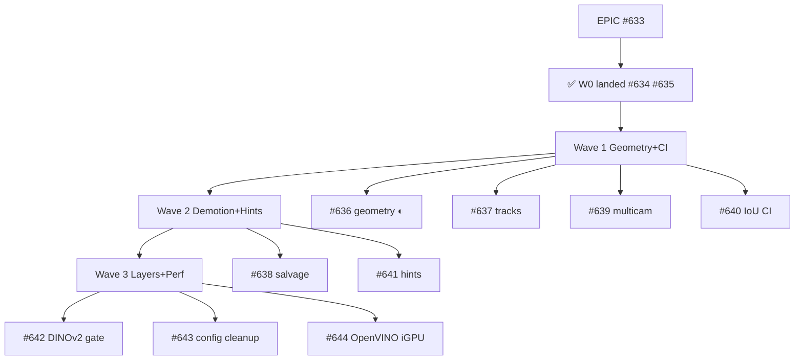
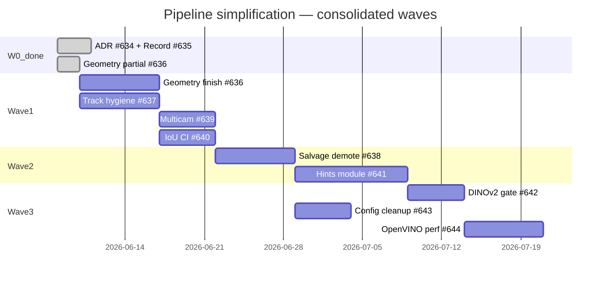

# Pipeline simplification plan — motion→detect→classify spine

**Дата:** 2026-06-10 (rev 2 — wave consolidation)  
**Статус:** Wave 1 active; W0 spine landed on prod VPS  
**Ветка:** `dev` @ [`7570c297f`](https://github.com/Gfermoto/BirdLense-Hub/commit/7570c297f)  
**EPIC:** [#633 — Pipeline simplification](https://github.com/Gfermoto/BirdLense-Hub/issues/633)  
**Инцидент:** [a656199a](https://github.com/Gfermoto/BirdLense-Hub/commit/2ff464057) — detect-first blind + ByteTrack merge двух зон кормушки  
**Предшественники:** [#601](https://github.com/Gfermoto/BirdLense-Hub/issues/601) (закрыт), [#606–#613](https://github.com/Gfermoto/BirdLense-Hub/issues/606) (CV recovery), `DUAL_STREAM_BBOX_SYNC_PLAN_2026-06.md`, `simplification_optimization_proposal.md`  
**Платформа:** Intel CPU + iGPU (OpenVINO). Coral / CUDA / Hailo / ROCm — **out of scope** (#644).

---

## 1. Executive summary

Prod funnel показал системную ошибку: **внешние сигналы (Frigate, BirdNET, eBird, multicam) стали gate'ами записи и persist**, а не подсказками классификатору. Параллельно накопились salvage/fusion ветки, detect-first как блокер record, и config-kostyli вместо контрактов.

**Цель программы:** вернуть **оригинальный продуктовый позвоночник**:

```text
motion → detection (YOLO/ByteTrack) → classification → DINOv2 → behavior
```

Frigate / BirdNET / eBird / multicamera — **только weighted hints в scoring классификатора**, никогда primary driver для recording, detection gates или fusion persist.

**Landed on dev + prod VPS** (rsync deploy, container healthy 2026-06-10):

| Issue | SHA | Status | Delivered |
|-------|-----|--------|-----------|
| [#634](https://github.com/Gfermoto/BirdLense-Hub/issues/634) ADR hints | [`9df7dc5b8`](https://github.com/Gfermoto/BirdLense-Hub/commit/9df7dc5b8) | **DONE** | `adr-classifier-hints-only.md`, drift lint (2+ forbidden patterns), `review_report.md` link |
| [#635](https://github.com/Gfermoto/BirdLense-Hub/issues/635) Recording contract | [`9df7dc5b8`](https://github.com/Gfermoto/BirdLense-Hub/commit/9df7dc5b8), [`7570c297f`](https://github.com/Gfermoto/BirdLense-Hub/commit/7570c297f) | **DONE** | `recording_gate_mode: motion_immediate` default; `requires_detect_first_before_record` off; legacy `detect_first` rollback + tests |
| [#636](https://github.com/Gfermoto/BirdLense-Hub/issues/636) Dual-stream geometry | [`2ff464057`](https://github.com/Gfermoto/BirdLense-Hub/commit/2ff464057) | **PARTIAL** | `openvino_native_lores_imgsz`, native 704×576 track imgsz, `track_spatial_split` default-on |
| — | [`2ff464057`](https://github.com/Gfermoto/BirdLense-Hub/commit/2ff464057) | partial | Raw-hits detect-first anchor (diagnostic under `motion_immediate`) |

**Остаётся в Wave 1:** единый bbox space detect→crop→overlay (#636), golden IoU CI (#640), best-keyframe crop (#637).

---

## 2. Принципы (non-negotiable)

| # | Прinciple | Implication |
|---|-----------|-------------|
| P1 | **Motion triggers record** | Motion/trigger → немедленный hires record **per camera**; YOLO не блокирует старт MP4 |
| P2 | **Detection owns bbox** | YOLO + ByteTrack — единственный источник bbox для crop, overlay, persist geometry |
| P3 | **Classifier hints only** | Frigate label, BirdNET audio, eBird prior, multicam peer — вход **одного** scoring-модуля; веса, не veto |
| P4 | **No salvage architecture** | `restore_detect_first_persist_rows`, weak/frigate salvage, linear fusion gates — удалить или demote в metrics-only |
| P5 | **One bbox space** | Native lores imgsz → remap в playback/main; detect и crop из **одного** keyframe |
| P6 | **Independent cameras** | Multicam = параллельные sessions; нет implicit single-cam lock, блокирующего вторую камеру |
| P7 | **Layers in order** | DINOv2 и behavior **только после** green SLO bbox/crop (IoU gate, funnel) |
| P8 | **Architecture, not config** | Запрет «починить prod» через `user_config` пороги; изменения — ADR + код + тест |

---

## 3. Что REMOVE vs KEEP

### REMOVE / demote

| Surface | Location (indicative) | Action |
|---------|----------------------|--------|
| Detect-first as recording gate | `detect_first.py`, `recording_session.detect_until_confirmed`, `requires_detect_first_before_record` | Record on motion; detect-first → diagnostic only |
| Fusion/salvage persist paths | `recording_finalize_parts/salvage.py`, `restore_detect_first_persist_rows`, weak/frigate salvage | Demote to classifier hints or delete |
| Frigate/BirdNET as detection gate | `frigate_live_track`, `mqtt_frigate_geometry_trigger`, BirdNET FIFO persist gate | Hint injection only |
| Multicam implicit lock | `recording_concurrency.py`, `_same_multi_camera_group` blocking | Independent sessions per camera |
| Dead fusion config + UI | `linear_skip_*`, `detect_first_*` salvage toggles, Settings fusion gates | Delete keys + UI (Phase 4) |
| Config hotfixes in prod | `user_config` threshold patches documented as workarounds | Replace with code contracts |

### KEEP

| Surface | Rationale |
|---------|-----------|
| Dual-stream detect/main RTSP | Frigate-grade geometry; fix remap, not remove stream |
| `inference_lores_wh` native aspect | Extend `2ff464057`; single canvas contract |
| ByteTrack + spatial split | Core track hygiene; default-on after tests |
| `dual_stream_timeline.py` | Offset detect↔record; golden IoU |
| Linear pipeline skeleton | `linear_pipeline.py`, `frame_processor.py`, `finalize_classification.py` |
| Optional integrations as adapters | Frigate MQTT, BirdNET MQTT, eBird API — thin, behind hint module |
| DINOv2 / behavior stacks | Unchanged order; gated on bbox SLO |
| `compare_detector_bboxes.py` | Frigate-parity CI smoke |

---

## 4. Фазы и GitHub issues



| Wave | Issue | Priority | Status | SHA / deliverable |
|------|-------|----------|--------|-------------------|
| W0 | [#634](https://github.com/Gfermoto/BirdLense-Hub/issues/634) ADR classifier hints | P0 | **DONE** | `9df7dc5b8` — ADR + drift lint |
| W0 | [#635](https://github.com/Gfermoto/BirdLense-Hub/issues/635) Recording contract | P0 | **DONE** | `9df7dc5b8`, `7570c297f` — `motion_immediate` on prod |
| W1 | [#636](https://github.com/Gfermoto/BirdLense-Hub/issues/636) Dual-stream geometry | P0 | **PARTIAL** | `2ff464057` — native lores; ⬜ single bbox space + ffprobe |
| W1 | [#637](https://github.com/Gfermoto/BirdLense-Hub/issues/637) Track hygiene | P1 | open | best-keyframe crop E2E |
| W1 | [#639](https://github.com/Gfermoto/BirdLense-Hub/issues/639) Multicam sessions | P1 | open | no peer recording block |
| W1 | [#640](https://github.com/Gfermoto/BirdLense-Hub/issues/640) Frigate-parity IoU CI | P1 | open | `compare_detector_bboxes` smoke |
| W2 | [#638](https://github.com/Gfermoto/BirdLense-Hub/issues/638) Demote fusion salvage | P1 | open | hints only, no salvage persist |
| W2 | [#641](https://github.com/Gfermoto/BirdLense-Hub/issues/641) Classifier hints module | P2 | open | one `classifier_hints/` module |
| W3 | [#642](https://github.com/Gfermoto/BirdLense-Hub/issues/642) DINOv2 + behavior gate | P2 | open | `bbox_slo_ok` flag |
| W3 | [#643](https://github.com/Gfermoto/BirdLense-Hub/issues/643) Dead config/UI cleanup | P2 | open | remove fusion gate keys |
| W3 | [#644](https://github.com/Gfermoto/BirdLense-Hub/issues/644) OpenVINO iGPU perf audit | P3 | open | OV ≥2025.4 smoke, W1 queue, LATENCY pin |

---

## 5. Regression matrix — «Не регрессировать»

| Capability | Metric / test | Baseline |
|------------|---------------|----------|
| Motion→record latency | Time motion event → MP4 first frame | No increase vs post-`2ff464057` |
| YOLO detection rate | `yolo_frames_with_tracks` / session | ≥ current prod median |
| Persist funnel | `post_fusion_persisted` when tracks>0 | ↑ vs 170/282 (incident baseline) |
| Bbox overlay IoU | Golden clips 3× favorite; `compare_detector_bboxes` | Median IoU ≥ gate in #7 |
| TG notify crop | Visual parity lores vs hires crop | No regression (`record_hires_crop`) |
| Multicam | Two cameras motion within 5s | Both sessions complete |
| Classifier accuracy | Golden species pack | No drop >2pp vs champion |
| Finalize p95 | `finalize_duration_ms` p95 | Trend ↓ toward <8s (parallel #601 KPI) |
| Frigate hint | When MQTT present | Species score nudge only; never blocks persist |
| BirdNET hint | Audio overlap window | Weight in classifier; never sole persist row |
| OpenVINO lores | BirdBox 704×576 | Native aspect preserved (`2ff464057`) |
| Spatial split | Two feeder zones one clip | Two tracks after split |

---

## 6. Incident a656199a — root cause & partial fix

**Symptoms:** YOLO «слепой» на prod; ByteTrack сливал двух птиц в одной зоне; detect-first не давал anchor при square resize.

**Root causes (architectural):**

1. OpenVINO forced square imgsz → birds shrunk on lores  
2. Detect-first treated as persist/recording gate instead of diagnostic  
3. No spatial split before crop/classify  
4. Salvage paths masked funnel drops instead of fixing geometry

**Partial fix [`2ff464057`](https://github.com/Gfermoto/BirdLense-Hub/commit/2ff464057):**

- Native lores for OpenVINO binary track  
- Raw-hits detect-first anchor (counts boxes, not lowered conf)  
- `track_spatial_split` before classify  
- Frigate assist unchanged (opt-in hint)

**Not done (Wave 1+):** single bbox space (#636 remainder), salvage demotion (#638), multicam lock (#639), CI parity gate (#640), best-keyframe crop (#637).

**Done since incident fix:** ADR hints (#634 `9df7dc5b8`), recording gate removal (#635 `9df7dc5b8`), native lores partial (#636 `2ff464057`).

---

## 7. Success criteria (program exit)

- [x] ADR accepted; `verify_processor_config_drift` fails if Frigate/BirdNET configured as gate — **`9df7dc5b8`**
- [x] `recording_gate_mode: motion_immediate` default on prod — **`9df7dc5b8`**, VPS healthy
- [ ] 7-day prod window: `tracks>0 → persist=0` rate **<10%** (was ~60% at incident)
- [ ] No prod `user_config` kostyli documented in runbooks for detection/fusion
- [ ] Golden IoU CI green on merge to `dev` (#640)
- [ ] Operator can explain pipeline in 5 steps: motion→record→detect→classify→(DINOv2→behavior)

---

## 8. Reference architectures (benchmark, not driver)

Frigate, BirdNET-Go, YA-WAMF и родственные feeder-проекты — **референсы для сравнения**, не источники требований. Полный разбор: [`pipeline_simplification_research.md`](pipeline_simplification_research.md).

### Frigate — dual-stream geometry benchmark

| Frigate pattern | BirdLense mapping | Action |
|-----------------|-------------------|--------|
| `detect` role = low-res substream, 5 fps | go2rtc detect RTSP + `inference_lores_wh` | KEEP; native aspect (#636) |
| `record` role = main stream, 15 fps | go2rtc main / hires MP4 | KEEP |
| Bbox on **record timeline** | `_storage_bbox_norm_for_overlay` → main norm | ADOPT single space (#636) |
| Motion → record segments (no object gate) | `recording_session` motion trigger | ADOPT (#635) |
| Detector crop ~320² in detect canvas | YOLO letterbox on lores | OK; не square-force |
| Frigate MQTT events | Classifier hint weight | HINT ONLY (#634, #641) |

**Не копировать:** generic COCO detector (у нас binary+species), отказ от dual-stream, Frigate как primary NVR для Hub.

### BirdNET-Go — audio hint precedence

- Range/location filter → confidence → repeat-confirmation (Deep Detection) → privacy filters.
- Cross-model merge по species key, async JobQueue для persist/notify.
- **ORT 1.25.x** — primary inference backend (TFLite phased out); CPU on Intel NUC, **не** OpenVINO EP по умолчанию.
- **У нас:** BirdNET не создаёт persist без YOLO track; adopt optional `hint_repeat_window_sec` в hints module.

### Frigate OpenVINO on Intel iGPU — parity checklist (#640, #644)

| Check | Frigate reference | BirdLense target |
|-------|-------------------|------------------|
| `/dev/dri` full map + render group | [GPU troubleshooting](https://docs.frigate.video/troubleshooting/gpu) | `docker-compose-intel-override-gen.sh` |
| OpenVINO ≥ 2025.4 (GPU runtime) | [Discussion #22059](https://github.com/blakeblackshear/frigate/discussions/22059) | Container smoke in #644 |
| Gen12 `stoi` fix | OV **2026.1.0+** [#23016](https://github.com/blakeblackshear/frigate/discussions/23016) | Pin after IoU gate green |
| YOLO letterbox, not square force | Frigate 320² for COCO; we use native 704×576 | `openvino_native_lores_imgsz` |
| Motion→record | No object confirmation gate | #635 |
| MQTT events | Downstream only | Classifier hint (#641) |

Operator runbook: [`intel_igpu_inference_guide.md`](intel_igpu_inference_guide.md).

### YA-WAMF — Frigate-adjacent classify

- Frigate snapshot → local classifier; BirdNET audio correlation optional.
- Multi-frame clip analysis для ambiguous species.
- **У нас over-built:** salvage persist из Frigate label; **keep:** in-processor finalize, YOLO owns bbox.

### Intel-only constraint

Deploy target: **Intel CPU + iGPU**. Google Coral, NVIDIA CUDA, Hailo, ROCm, EdgeTPU **вне scope** EPIC и Wave 5 (#644).

---

## 9. Intel OpenVINO + iGPU — constraints & best practices

### Platform

| Item | Value |
|------|-------|
| Binary detect backend | OpenVINO IR (`best_openvino_model/`) |
| Live device | `intel:gpu` (iHD), fallback `intel:cpu` with metric |
| Classifier device | Same or `intel:cpu` if VRAM-bound |
| Docker | `/dev/dri/renderD*`, `group_add`, `LIBVA_DRIVER_NAME=iHD` |
| Lores shape | Native aspect (BirdBox 704×576), **no square force** |

### Inference modes

| Mode | When | Config |
|------|------|--------|
| **LATENCY** | Live detect loop (1–2 cameras) | `performance_mode=LATENCY`, 1 async request/stream |
| **THROUGHPUT** | Batch track regen / offline benchmark | Multi-request only in regen worker |
| FP16 | Default GPU compile | OpenVINO export |
| INT8/NNCF | Wave 5 (#644) after IoU gate green | Requires golden re-validation |

### Preprocessing contract

```text
detect frame (WxH native) → letterbox to model [1,3,H,W] (pad 114)
  → inference → bbox in lores space → remap to main/MP4 norm
```

- Export IR with fixed rectangular `[1,3,H,W]` matching `inference_lores_wh`.
- Postprocess: inverse letterbox scale before `yolo_geometry` remap.
- Metric: `bbox_remap_mismatch_total`, backend downgrade counter.

### Anti-patterns (incident lessons)

1. `inference_lores_px` square on 4:3 stream → shrunk birds (a656199a).
2. Silent torch fallback without `inference_backend_fallback_total`.
3. Treating OpenVINO conf parity with torch without `compare_detector_bboxes` gate (#640).
4. OpenVINO **2025.3** pin — Frigate field reports GPU `CL_INVALID_VALUE` and Gen12 `stoi` ([#22059](https://github.com/blakeblackshear/frigate/discussions/22059), [#23016](https://github.com/blakeblackshear/frigate/discussions/23016)).
5. BirdNET ORT on iGPU via OpenVINO EP — unnecessary; reserve iGPU for YOLO (#644).

### OpenVINO version policy (#644)

| Milestone | Minimum OV | Rationale |
|-----------|------------|-----------|
| GPU live detect | 2025.4+ | Sub-buffer runtime fix |
| Gen12 iGPU compile | 2026.1.0+ | `stoi` compile fix |
| INT8/NNCF quant | After #640 IoU green | Golden re-validation required |

Smoke: `compile_model(binary_ir, 'GPU')` in deploy container — see [`intel_igpu_inference_guide.md`](intel_igpu_inference_guide.md) §2.

### Risk register (OpenVINO / Intel)

| Risk | Likelihood | Mitigation |
|------|------------|------------|
| OV version drift in base image | Medium | Pin + smoke in #644; document in deploy runbook |
| iGPU not in `available_devices` | Low | Full `/dev/dri` map; render group; driver check |
| Non-AVX CPU (Jasper Lake) | Low | OpenVINO CPU path only; avoid TF-heavy paths |
| BirdNET sidecar CPU load | Medium | ORT 1.25 CPU OK; async MQTT; no persist gate |
| Frigate MQTT stale hint | Medium | TTL + weight cap in hints module (#641) |

---

## 10. Wave roadmap (3 waves + W0 done)

**Consolidation (rev 2):** бывшие Wave 0–2 сжаты в **W0 done** + **3 активные волны**. Блокер «ADR перед кодом» снят — `#634`/`#635` на prod.



### W0 — Spine contract (**DONE**, prod VPS 2026-06-10)

| Issue | SHA | Acceptance met |
|-------|-----|----------------|
| #634 ADR | `9df7dc5b8` | ADR `accepted`; drift: `frigate_standalone_when_no_yolo`, `frigate_trigger_review_salvage_allow_without_yolo_tracks` |
| #635 Record | `9df7dc5b8`, `7570c297f` | `motion_immediate` default; `test_recording_gate_motion_immediate.py`; prod `detection_scheduler.py` |
| #636 partial | `2ff464057` | `openvino_native_lores_imgsz: true`; `track_spatial_split_*` in `default_config` |

### Wave 1 — Geometry + tracks + CI (**active**, parallel)

| Stream | Issue | Parallel | Gate SLO |
|--------|-------|----------|----------|
| A | #636 geometry finish | B, D | Overlay IoU median ≥ 0.45 on 3 clips |
| B | #637 track hygiene | A | 2-zone clip → ≥2 tracks; TG crop Δ < 5% norm |
| C | #639 multicam | — | 2 cams / 5s → 2 MP4 + 2 DB rows |
| D | #640 IoU CI | A | `compare_detector_bboxes` job on geometry PRs |

**Start order:** `#636` + `#637` + `#640` parallel → `#639` when multicam fixture ready.

### Wave 2 — Demotion + hints (after Wave 1 IoU green)

| Stream | Issue | Gate SLO |
|--------|-------|----------|
| A | #638 salvage demote | `salvage_persist_total` → 0 default; `tracks>0→persist=0` < 25% staging |
| B | #641 hints module | Golden pack ±0% hints off; +2pp hints on fixture |

### Wave 3 — Layers + cleanup + Intel perf (after Wave 2)

| Stream | Issue | Gate SLO |
|--------|-------|----------|
| A | #642 DINOv2/behavior | Skip when `bbox_slo_ok=false` |
| B | #643 config/UI cleanup | 0 fusion gate keys in `default_config` |
| C | #644 OpenVINO iGPU perf | Finalize p95 < 8s; OV GPU compile smoke; detect p50 < 80ms |

---

## 11. Classifier hints module — design sketch

### Purpose

Единая точка входа для внешних сигналов в **scoring** классификатора. Никогда не создаёт persist row, не gate'ит record/detect.

### Module layout (target)

```text
processor/src/classifier_hints/
  __init__.py          # public API
  types.py             # HintSource, HintPayload, ScoringContext
  collectors.py        # Frigate MQTT, BirdNET FIFO, eBird API, multicam peer
  precedence.py        # filter order (range → conf → repeat)
  scorer.py            # merge hints into species scores
  config.py            # weight table (tier: advanced)
```

### Public API

```python
def collect_hints(
    *,
    camera_id: str,
    track: dict,
    mqtt_events: Iterable[dict],
    app_config: Mapping,
    window_sec: float,
) -> list[HintPayload]: ...

def apply_hints_to_rows(
    rows: list[dict],
    hints: list[HintPayload],
    *,
    app_config: Mapping,
) -> list[dict]: ...
```

### Hint sources & weights (default)

| Source | Key | Default weight | Max delta | Gate? |
|--------|-----|----------------|-----------|-------|
| YOLO+classifier base | `base_confidence` | 0.55 | — | N/A (primary) |
| Detector conf | `detector_confidence` | 0.15 | — | No |
| Classifier top-1 | `classifier_confidence` | 0.12 | — | No |
| BirdNET audio | `birdnet_prior` | 0.08 | +0.15 score | No |
| eBird regional | `regional_prior` | 0.05 | +0.10 if in list | No |
| Multicam peer | `multicam_support` | 0.05 | +0.10 | No |
| Frigate label | `frigate_label_hint` | 0.06 | +0.12 | No |

Weights migrate from `weighted_species_arbiter.py`; arbiter becomes thin wrapper → `scorer.py`.

### Precedence (BirdNET-Go inspired)

```text
1. Regional range filter (eBird) — zero weight if species out of range
2. Min confidence floor (classifier) — unchanged
3. Hint score blend (weighted sum, capped)
4. Optional repeat-confirmation: same Frigate/BirdNET species ≥2 in window_sec
5. Output: adjusted confidence + hint_trace[] for decision_trace
```

### Forbidden paths (ADR #634 lint)

- `birdnet_fifo_persist` creating rows without track
- `restore_detect_first_persist_rows`
- `frigate_live_track` / `mqtt_frigate_geometry_trigger` as record start
- `linear_skip_*_salvage` as persist bypass

### Integration point

`finalize_classification.py` → single call:

```python
hints = collect_hints(camera_id=..., track=..., mqtt_events=..., app_config=cfg)
rows = apply_hints_to_rows(classifier_rows, hints, app_config=cfg)
```

### Tests

- `test_classifier_hints.py`: hint nudges top-1; zero rows when tracks empty
- `test_verify_processor_config_drift.py`: forbidden gate keys fail CI

---

## 12. Metrics & acceptance SLO per wave

| Wave | Issue | Status | Primary SLO | Secondary metrics | CI gate |
|------|-------|--------|-------------|-------------------|---------|
| W0 | #634 | **DONE** `9df7dc5b8` | Drift lint 100% forbidden gate patterns | ADR in contributor docs | `verify_processor_config_drift` |
| W0 | #635 | **DONE** `9df7dc5b8` | Motion→MP4 p95 ≤ baseline post-`2ff464057` | `sessions_without_pre_detect_anchor` allowed | `test_recording_gate_motion_immediate.py` |
| W1 | #636 | **PARTIAL** `2ff464057` | Overlay IoU median ≥ 0.45 on 3 clips | `bbox_remap_mismatch_total` → 0 | `test_yolo_geometry*.py` |
| W1 | #637 | open | 2-zone clip → ≥2 tracks | TG crop Δ < 5% norm | `test_track_spatial_split.py` |
| W1 | #639 | open | 2 cameras / 5s → 2 MP4 + 2 DB rows | `multicam_blocked_by_peer_total` → 0 | `test_concurrent_recording_smoke.py` |
| W1 | #640 | open | Median IoU ≥ 0.45 (tighten later) | Per-clip debug artifact | `compare_detector_bboxes` job |
| W2 | #638 | open | `tracks>0 → persist=0` < 25% staging | `salvage_persist_total` → 0 | golden finalize pack |
| W2 | #641 | open | Golden top-1 ±0% hints off; +2pp on fixture | `hint_trace` in decision_trace | `test_classifier_hints.py` |
| W3 | #642 | open | Layers skip when `bbox_slo_ok=false` | readiness exposes gate | behavior tests when green |
| W3 | #643 | open | 0 fusion gate keys in `default_config` | Settings search clean | drift + UI snapshot |
| W3 | #644 | open | Finalize p95 < 8s; OV GPU smoke; detect p50 < 80ms | `inference_backend_fallback_total` → 0 | `test_processor_runtime_profile_openvino.py` |

### Program exit SLO (unchanged)

- 7-day prod: `tracks>0 → persist=0` **< 10%**
- Golden IoU CI green on `dev`
- Operator 5-step explainability

---

## 13. References

- Research: [`pipeline_simplification_research.md`](pipeline_simplification_research.md)  
- Intel iGPU ops: [`intel_igpu_inference_guide.md`](intel_igpu_inference_guide.md)  
- Commits: [2ff464057](https://github.com/Gfermoto/BirdLense-Hub/commit/2ff464057) geometry partial; [9df7dc5b8](https://github.com/Gfermoto/BirdLense-Hub/commit/9df7dc5b8) ADR+#635; [7570c297f](https://github.com/Gfermoto/BirdLense-Hub/commit/7570c297f) legacy gate tests  
- Closed EPIC: [#601](https://github.com/Gfermoto/BirdLense-Hub/issues/601) — storage/NVR; superseded for CV spine by this plan  
- CV recovery: [#606](https://github.com/Gfermoto/BirdLense-Hub/issues/606) — dual-stream phases E–G  
- Dual-stream: [`DUAL_STREAM_BBOX_SYNC_PLAN_2026-06.md`](DUAL_STREAM_BBOX_SYNC_PLAN_2026-06.md)  
- Code: `detect_first.py`, `recording_session.py`, `track_spatial_split.py`, `inference_lores.py`, `recording_finalize_parts/salvage.py`, `recording_concurrency.py`, `weighted_species_arbiter.py`  
- Scripts: `scripts/compare_detector_bboxes.py`, `scripts/report_failure_mode_funnel.py`  
- Reports: `docs/reports/perf/runtime_pipeline_profile_latest.md`, `review_report.md`
