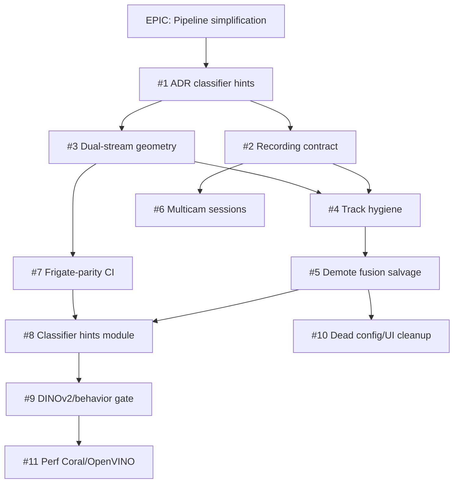

# Pipeline simplification plan — motion→detect→classify spine

**Дата:** 2026-06-10  
**Статус:** active execution track  
**Ветка:** `dev`  
**EPIC:** [#633 — Pipeline simplification](https://github.com/Gfermoto/BirdLense-Hub/issues/633)  
**Инцидент:** [a656199a](https://github.com/Gfermoto/BirdLense-Hub/commit/2ff464057) — detect-first blind + ByteTrack merge двух зон кормушки  
**Предшественники:** [#601](https://github.com/Gfermoto/BirdLense-Hub/issues/601) (закрыт), [#606–#613](https://github.com/Gfermoto/BirdLense-Hub/issues/606) (CV recovery), `DUAL_STREAM_BBOX_SYNC_PLAN_2026-06.md`, `simplification_optimization_proposal.md`

---

## 1. Executive summary

Prod funnel показал системную ошибку: **внешние сигналы (Frigate, BirdNET, eBird, multicam) стали gate'ами записи и persist**, а не подсказками классификатору. Параллельно накопились salvage/fusion ветки, detect-first как блокер record, и config-kostyli вместо контрактов.

**Цель программы:** вернуть **оригинальный продуктовый позвоночник**:

```text
motion → detection (YOLO/ByteTrack) → classification → DINOv2 → behavior
```

Frigate / BirdNET / eBird / multicamera — **только weighted hints в scoring классификатора**, никогда primary driver для recording, detection gates или fusion persist.

**Частичные шаги уже в dev** ([`2ff464057`](https://github.com/Gfermoto/BirdLense-Hub/commit/2ff464057)):

| Fix | Что сделано | Что остаётся |
|-----|-------------|--------------|
| OpenVINO native lores | BirdBox 704×576 без принудительного square 704² | Единый bbox space detect→crop→overlay (Phase 2 EPIC) |
| Detect-first raw hits | Anchor по raw YOLO boxes без снижения conf floor | Убрать detect-first как **recording gate** (Phase 1 EPIC) |
| `track_spatial_split` | Split при center jump >0.18 norm | Default-on + crop from best keyframe (Phase 3 EPIC) |
| Frigate assist | Opt-in hint в detect-first anchor | ADR: hints never gate (Phase 0 EPIC) |

---

## 2. Принципы (non-negotiable)

| # | Прinciple | Implication |
|---|-----------|-------------|
| P1 | **Motion triggers record** | Motion/trigger → немедленный hires record **per camera**; YOLO не блокирует старт MP4 |
| P2 | **Detection owns bbox** | YOLO + ByteTrack — единственный источник bbox для crop, overlay, persist geometry |
| P3 | **Classifier hints only** | Frigate label, BirdNET audio, eBird prior, multicam peer — вход **одного** scoring-модуля; веса, не veto |
| P4 | **No salvage architecture** | `restore_detect_first_persist_rows`, weak/frigate salvage, linear fusion gates — удалить или demote в metrics-only |
| P5 | **One bbox space** | Native lores imgsz → remap в playback/main; detect и crop из **одного** keyframe |
| P6 | **Independent cameras** | Multicam = параллельные sessions; нет implicit single-cam lock, блокирующего вторую камеру |
| P7 | **Layers in order** | DINOv2 и behavior **только после** green SLO bbox/crop (IoU gate, funnel) |
| P8 | **Architecture, not config** | Запрет «починить prod» через `user_config` пороги; изменения — ADR + код + тест |

---

## 3. Что REMOVE vs KEEP

### REMOVE / demote

| Surface | Location (indicative) | Action |
|---------|----------------------|--------|
| Detect-first as recording gate | `detect_first.py`, `recording_session.detect_until_confirmed`, `requires_detect_first_before_record` | Record on motion; detect-first → diagnostic only |
| Fusion/salvage persist paths | `recording_finalize_parts/salvage.py`, `restore_detect_first_persist_rows`, weak/frigate salvage | Demote to classifier hints or delete |
| Frigate/BirdNET as detection gate | `frigate_live_track`, `mqtt_frigate_geometry_trigger`, BirdNET FIFO persist gate | Hint injection only |
| Multicam implicit lock | `recording_concurrency.py`, `_same_multi_camera_group` blocking | Independent sessions per camera |
| Dead fusion config + UI | `linear_skip_*`, `detect_first_*` salvage toggles, Settings fusion gates | Delete keys + UI (Phase 4) |
| Config hotfixes in prod | `user_config` threshold patches documented as workarounds | Replace with code contracts |

### KEEP

| Surface | Rationale |
|---------|-----------|
| Dual-stream detect/main RTSP | Frigate-grade geometry; fix remap, not remove stream |
| `inference_lores_wh` native aspect | Extend `2ff464057`; single canvas contract |
| ByteTrack + spatial split | Core track hygiene; default-on after tests |
| `dual_stream_timeline.py` | Offset detect↔record; golden IoU |
| Linear pipeline skeleton | `linear_pipeline.py`, `frame_processor.py`, `finalize_classification.py` |
| Optional integrations as adapters | Frigate MQTT, BirdNET MQTT, eBird API — thin, behind hint module |
| DINOv2 / behavior stacks | Unchanged order; gated on bbox SLO |
| `compare_detector_bboxes.py` | Frigate-parity CI smoke |

---

## 4. Фазы и GitHub issues



| Phase | Issue | Priority | Deliverable |
|-------|-------|----------|-------------|
| 0 | [#634](https://github.com/Gfermoto/BirdLense-Hub/issues/634) ADR: classifier hints contract | P0 | `docs/strategy/adr-classifier-hints-only.md`; lint in `verify_processor_config_drift` |
| 1 | [#635](https://github.com/Gfermoto/BirdLense-Hub/issues/635) Recording contract | P0 | Motion→hires record; drop detect-first gate |
| 1 | [#636](https://github.com/Gfermoto/BirdLense-Hub/issues/636) Dual-stream geometry | P0 | Native lores + single bbox space *(partial: `2ff464057`)* |
| 2 | [#637](https://github.com/Gfermoto/BirdLense-Hub/issues/637) Track hygiene | P1 | Spatial split default; crop from best keyframe |
| 2 | [#638](https://github.com/Gfermoto/BirdLense-Hub/issues/638) Demote fusion salvage | P1 | Hints feed classifier only |
| 2 | [#639](https://github.com/Gfermoto/BirdLense-Hub/issues/639) Multicam independent sessions | P1 | No single-cam lock |
| 2 | [#640](https://github.com/Gfermoto/BirdLense-Hub/issues/640) Frigate-parity benchmark gate | P1 | `compare_detector_bboxes` CI smoke |
| 3 | [#641](https://github.com/Gfermoto/BirdLense-Hub/issues/641) Classifier hints pipeline | P2 | One module: Frigate + BirdNET + eBird weights |
| 3 | [#642](https://github.com/Gfermoto/BirdLense-Hub/issues/642) DINOv2 + behavior after SLO | P2 | Feature flag tied to IoU/funnel green |
| 4 | [#643](https://github.com/Gfermoto/BirdLense-Hub/issues/643) Dead config/UI cleanup | P2 | Remove deprecated fusion gates |
| 5 | [#644](https://github.com/Gfermoto/BirdLense-Hub/issues/644) Performance audit | P3 | Coral/OpenVINO + W1 queue hygiene |

---

## 5. Regression matrix — «Не регрессировать»

| Capability | Metric / test | Baseline |
|------------|---------------|----------|
| Motion→record latency | Time motion event → MP4 first frame | No increase vs post-`2ff464057` |
| YOLO detection rate | `yolo_frames_with_tracks` / session | ≥ current prod median |
| Persist funnel | `post_fusion_persisted` when tracks>0 | ↑ vs 170/282 (incident baseline) |
| Bbox overlay IoU | Golden clips 3× favorite; `compare_detector_bboxes` | Median IoU ≥ gate in #7 |
| TG notify crop | Visual parity lores vs hires crop | No regression (`record_hires_crop`) |
| Multicam | Two cameras motion within 5s | Both sessions complete |
| Classifier accuracy | Golden species pack | No drop >2pp vs champion |
| Finalize p95 | `finalize_duration_ms` p95 | Trend ↓ toward <8s (parallel #601 KPI) |
| Frigate hint | When MQTT present | Species score nudge only; never blocks persist |
| BirdNET hint | Audio overlap window | Weight in classifier; never sole persist row |
| OpenVINO lores | BirdBox 704×576 | Native aspect preserved (`2ff464057`) |
| Spatial split | Two feeder zones one clip | Two tracks after split |

---

## 6. Incident a656199a — root cause & partial fix

**Symptoms:** YOLO «слепой» на prod; ByteTrack сливал двух птиц в одной зоне; detect-first не давал anchor при square resize.

**Root causes (architectural):**

1. OpenVINO forced square imgsz → birds shrunk on lores  
2. Detect-first treated as persist/recording gate instead of diagnostic  
3. No spatial split before crop/classify  
4. Salvage paths masked funnel drops instead of fixing geometry

**Partial fix [`2ff464057`](https://github.com/Gfermoto/BirdLense-Hub/commit/2ff464057):**

- Native lores for OpenVINO binary track  
- Raw-hits detect-first anchor (counts boxes, not lowered conf)  
- `track_spatial_split` before classify  
- Frigate assist unchanged (opt-in hint)

**Not done:** recording gate removal, salvage demotion, ADR hints contract, multicam lock, CI parity gate.

---

## 7. Success criteria (program exit)

- [ ] ADR accepted; `verify_processor_config_drift` fails if Frigate/BirdNET configured as gate  
- [ ] 7-day prod window: `tracks>0 → persist=0` rate **<10%** (was ~60% at incident)  
- [ ] No prod `user_config` kostyli documented in runbooks for detection/fusion  
- [ ] Golden IoU CI green on merge to `dev`  
- [ ] Operator can explain pipeline in 5 steps: motion→record→detect→classify→(DINOv2→behavior)

---

## 8. References

- Commit: [2ff464057](https://github.com/Gfermoto/BirdLense-Hub/commit/2ff464057) — partial root fix (a656199a)  
- Closed EPIC: [#601](https://github.com/Gfermoto/BirdLense-Hub/issues/601) — storage/NVR; superseded for CV spine by this plan  
- CV recovery: [#606](https://github.com/Gfermoto/BirdLense-Hub/issues/606) — dual-stream phases E–G  
- Code: `detect_first.py`, `recording_session.py`, `track_spatial_split.py`, `inference_lores.py`, `recording_finalize_parts/salvage.py`, `recording_concurrency.py`, `weighted_species_arbiter.py`  
- Scripts: `scripts/compare_detector_bboxes.py`, `scripts/report_failure_mode_funnel.py`  
- Reports: `docs/reports/perf/runtime_pipeline_profile_latest.md`, `review_report.md`
