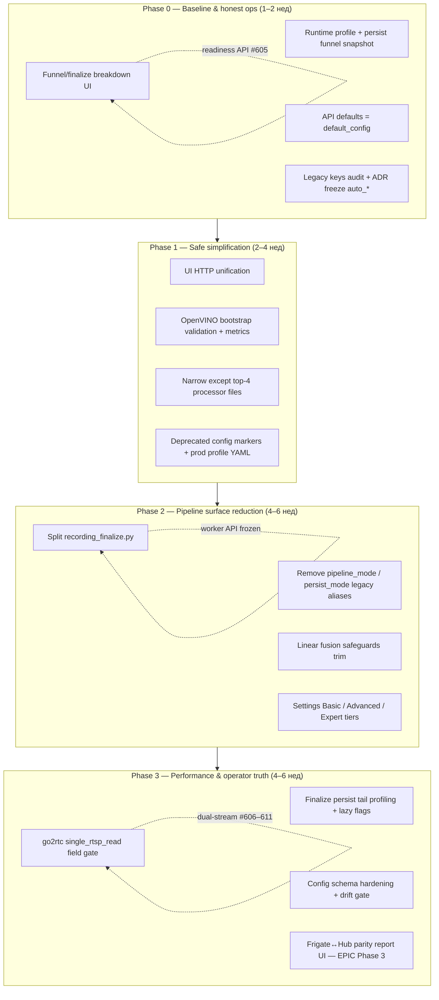

# Консилиум рефакторинга BirdLense Hub — master plan

**Дата:** 2026-06-10  
**Статус:** research / planning (без изменений application-кода)  
**EPIC:** [#601 — Консилиум: архитектурная программа Hub](https://github.com/Gfermoto/BirdLense-Hub/issues/601)  
**Источники синтеза:** `simplification_optimization_proposal.md`, `CONSORTIUM_ARCHITECTURE_PLAN_2026-06.md`, `CV_PIPELINE_RECOVERY_PLAN_2026-06.md`, `review_report.md`, codebase exploration (wave1 processor + wave2 web/ui/config)

> **Примечание:** файлы `docs/strategy/consortium/wave1_processor.md` и `wave2_web_ui_config.md` на момент синтеза **отсутствовали** — wave-контент восстановлен из proposal + обхода репозитория subagent'ами.

---

## Executive summary

BirdLense Hub — зрелый монолит (~120 processor modules, 129 web services, OpenAPI ~5784 строк, default_config ~1283 строк). Продуктовый контракт сформулирован: **standalone-first**, **linear pipeline**, **track-first persist**, **dual-stream detect/main** (Frigate-grade).

**Две параллельные программы уже частично выполнены:**

| Программа | EPIC / issues | Статус |
|-----------|---------------|--------|
| Storage / NVR parity (Frigate core) | #601, #602–#605 | ✅ код в dev/prod; KPI orphan/funnel — наблюдение |
| CV pipeline recovery | #606–#613 | ✅ закрыты по чеклисту; полевая приёмка частично red |

**Новая волна (этот план)** — не дублировать закрытые P0, а **сжать cognitive load и perf-хвост**:

1. **Finalize god-module** (~1842 LOC) + persist tail p95 **28.6 s** (77% finalize p95 37.3 s)
2. **Legacy surface** — aliases `pipeline_mode: legacy`, salvage/fusion safeguards, ~200+ Settings keys
3. **Web/UI/config** — смешанный HTTP (fetch/axios/csrfFetch), funnel API без UI, schema subset vs full YAML
4. **Reliability hygiene** — ~187× `except Exception`, OpenVINO silent torch fallback

**Стратегия:** 4 фазы с жёсткими зависимостями; каждая фаза — working software + regression matrix «Не регрессировать». ML/SOTA и web-services merge (>80 facades) — **после** Phase 3.

**Целевой эффект (8–12 нед):**

- finalize p95 → **<8 s** на prod profile
- −30–40% contributor cognitive load (config/legacy paths)
- единый UI HTTP/error contract; funnel виден оператору
- mypy baseline для public APIs (Phase 4 backlog)

---

## Фазы и зависимости

### Phase 0 — Baseline & honest ops

| ID | Deliverable | Acceptance | Issue |
|----|-------------|------------|-------|
| 0.1 | Экспорт baseline: runtime profile, persist funnel, config drift | Артефакты в `docs/reports/`; drift_count=0 | — (runbook) |
| 0.2 | **Funnel + finalize stage hints в System UI** | Оператор видит `yolo_frames_with_tracks`, failure_mode без curl | [#614](https://github.com/Gfermoto/BirdLense-Hub/issues/614) |
| 0.3 | API retention GET defaults = `default_config` | `auto_run` не «true by default» в API vs YAML | [#615](https://github.com/Gfermoto/BirdLense-Hub/issues/615) |
| 0.4 | Legacy keys audit + freeze новых `auto_*` без ADR | PR checklist; список deprecated в default_config | [#616](https://github.com/Gfermoto/BirdLense-Hub/issues/616) |

**Exit:** readiness card показывает funnel; Phase 0 EPIC (#601) 0.2–0.4 закрыты.

### Phase 1 — Safe simplification

| ID | Deliverable | Acceptance | Issue |
|----|-------------|------------|-------|
| 1.1 | Единый UI HTTP (`apiFetch` / `csrfFetch`) | axios/raw fetch только через wrapper; CI green | [#617](https://github.com/Gfermoto/BirdLense-Hub/issues/617) |
| 1.2 | OpenVINO IR path + imgsz validation at bootstrap | readiness metric; auto→torch с counter, не silent | [#618](https://github.com/Gfermoto/BirdLense-Hub/issues/618) |
| 1.3 | Narrow `except Exception` в finalize, session, go2rtc, mqtt | OOM/IO re-raise; unit tests на critical paths | [#619](https://github.com/Gfermoto/BirdLense-Hub/issues/619) |
| 1.4 | Deprecated keys в default_config + example prod profile | `deprecated_keys.py` sync; docs | [#616](https://github.com/Gfermoto/BirdLense-Hub/issues/616) (shared) |

**Exit:** нет регрессии CI; YOLO blind из-за битого IR — degraded readiness, не unknown ok.

### Phase 2 — Pipeline surface reduction

| ID | Deliverable | Acceptance | Issue |
|----|-------------|------------|-------|
| 2.1 | Декомпозиция `recording_finalize.py` | модули <400 LOC; worker API без изменений; rollback tests green | [#620](https://github.com/Gfermoto/BirdLense-Hub/issues/620) |
| 2.2 | Удаление `pipeline_mode` / `persist_mode` legacy aliases | migration note; user_config с legacy → warning only 1 release | [#621](https://github.com/Gfermoto/BirdLense-Hub/issues/621) |
| 2.3 | Linear-only fusion safeguards (BirdNET/Frigate = hints) | funnel fusion_drop не ↑; Frigate salvage opt-in by profile | [#622](https://github.com/Gfermoto/BirdLense-Hub/issues/622) |
| 2.4 | Settings tiers Basic / Advanced / Expert | expert hidden by default; `check-settings-ui-coverage.py` green | [#623](https://github.com/Gfermoto/BirdLense-Hub/issues/623) |

**Exit:** один decision path; Settings не экспонирует legacy keys в Overview.

### Phase 3 — Performance & operator truth

| ID | Deliverable | Acceptance | Issue |
|----|-------------|------------|-------|
| 3.1 | Persist tail: sub-stage metrics + lazy dataset_crops/behavior/ReID | finalize p95 <8s на prod profile; breakdown в session_summary | [#624](https://github.com/Gfermoto/BirdLense-Hub/issues/624) |
| 3.2 | `single_rtsp_read` production validation | dual-stream IoU parity gate; idle CPU ↓ без BirdBox regression | [#625](https://github.com/Gfermoto/BirdLense-Hub/issues/625) |
| 3.3 | Config schema расширение + prod drift blocking | Pydantic покрывает P0 keys; deploy gate | [#626](https://github.com/Gfermoto/BirdLense-Hub/issues/626) |
| 3.4 | Operator: disk/quota/orphan/funnel system card | EPIC #601 Phase 3; parity mismatches classified | [#627](https://github.com/Gfermoto/BirdLense-Hub/issues/627) |

**Exit:** SLO finalize; operator truth без skip-gates на deploy smoke.

### Phase 4 — Backlog (после Phase 3)

- Web services merge (~107 → ~80 facades)
- Schema-driven Settings forms
- mypy/pyright baseline processor + web
- Structured logging / OTel

---

## Consolidated issue backlog (dedupe wave1 + wave2)

| Priority | Тема | Wave | Effort | Impact | GitHub | Зависит от |
|----------|------|------|--------|--------|--------|------------|
| P1 | Funnel UI | web | S | ★★★★ | [#614](https://github.com/Gfermoto/BirdLense-Hub/issues/614) | #605 (done) |
| P1 | API retention defaults | web | S | ★★★ | [#615](https://github.com/Gfermoto/BirdLense-Hub/issues/615) | — |
| P2 | Legacy config audit | config | M | ★★★ | [#616](https://github.com/Gfermoto/BirdLense-Hub/issues/616) | — |
| P1 | HTTP client unification | ui | S | ★★★ | [#617](https://github.com/Gfermoto/BirdLense-Hub/issues/617) | — |
| P0 | OpenVINO bootstrap | processor | S | ★★★★ | [#618](https://github.com/Gfermoto/BirdLense-Hub/issues/618) | — |
| P1 | Narrow except P0 paths | processor | M | ★★★ | [#619](https://github.com/Gfermoto/BirdLense-Hub/issues/619) | — |
| P1 | Finalize decomposition | processor | L | ★★★★★ | [#620](https://github.com/Gfermoto/BirdLense-Hub/issues/620) | #619 |
| P2 | pipeline_mode cleanup | processor | M | ★★★ | [#621](https://github.com/Gfermoto/BirdLense-Hub/issues/621) | #620 |
| P1 | Linear fusion trim | processor | L | ★★★★ | [#622](https://github.com/Gfermoto/BirdLense-Hub/issues/622) | #621 |
| P2 | Settings expert tiers | ui | M | ★★★★ | [#623](https://github.com/Gfermoto/BirdLense-Hub/issues/623) | #616 |
| P0 | Finalize persist tail | processor | M | ★★★★★ | [#624](https://github.com/Gfermoto/BirdLense-Hub/issues/624) | #620 |
| P2 | go2rtc single-read prod | processor | L | ★★★★ | [#625](https://github.com/Gfermoto/BirdLense-Hub/issues/625) | #624, dual-stream |
| P2 | Config schema hardening | config | M | ★★★★ | [#626](https://github.com/Gfermoto/BirdLense-Hub/issues/626) | #616 |
| P1 | Operator system card | web/ui | M | ★★★★ | [#627](https://github.com/Gfermoto/BirdLense-Hub/issues/627) | #614 |

**Исключено из backlog (не дублировать):**

- #602–#605, #612–#613 — storage/readiness/detect-first/dense persist (**CLOSED**)
- #606–#611 — CV recovery (**CLOSED**); полевая валидация — через regression matrix
- #376 ESPHome radar, #350 NAS storage, #243 field QA weights — **другой scope**

**Не делаем (anti-roadmap):**

- «Один RTSP для всего» без dual-stream parity gate
- Frigate bbox как persist source
- Новые fusion gates без funnel metric
- Orphan Purge UI как primary fix (#601)
- Web services big-bang merge до finalize split

---

## Regression matrix — «Не регрессировать»

Инциденты, которые уже ломали prod; **каждый child issue** должен пройти checklist.

| Инцидент | Симптом | Root cause (известный) | Guard metric / test | Затронутые фазы |
|----------|---------|------------------------|---------------------|-----------------|
| **YOLO blind** | Frigate видит, Hub overlay пустой; `yolo: unknown` при health ok | OpenVINO IR path пустой; imgsz mismatch; silent torch fallback; prod user_config openvino | `yolo_frames_with_tracks/yolo_frames_ran ≥ 0.15`; readiness `yolo=degraded` not ok | P1 (#620), P3 |
| **Crash loop probe** | Processor restart; bootstrap timeout в verify-stack | Stream probe каждую сессию; OpenVINO ctor fail; broad except скрывает fail | `make verify` post-deploy; probe cache; bootstrap fail-fast counter | P1 (#620, #621) |
| **Anchor skip** | Запись есть, persist пустой; detect-first не подтверждён | `detect_first_confirm_min_hits` drift; anchor conf < live floor | `detect_first_confirmed` → first track ≤2s; #612 acceptance | P2 (#624) |
| **SKIP floors** | ByteTrack `boxes.id is None`; tracks=0 | Hardcoded conf 0.22/0.30 vs YAML; `track_high_thresh` drift | Unit: missing key = default_config; #607 acceptance | P2 (#623) |
| **Config drift BirdBox** | VPS ≠ default_config; gates 0.72/0.73 skip | rsync не трогает user_config; legacy camera_overrides | `verify_processor_config_drift`; documented effective config | P0 (#617, #618), P3 (#628) |
| **Finalize orphan** | mp4 на disk, нет DB row | non-atomic finalize | #602 rollback tests; ReconcileJob #604 | P2 (#622) |
| **Persist funnel drop** | tracks>0 → persist=0 (170/282) | fusion gates, object_confirm, post_fusion rejections | funnel dashboard; fusion_drop <20% | P2 (#624), P0 (#616) |
| **BBox remap mismatch** | Overlay смещён vs main | dual-stream timeline desync | `bbox_remap_mismatch_total`; golden IoU | P3 (#627) |
| **Sticky Bird species** | UI «Птица» вместо вида | classifier defer + empty events → Bird | named species rate on favorites; #609 | P2 (#622 finalize) |
| **Deploy skip-gates** | `BIRDLENSE_SKIP_*_GATE=1` на prod | field metrics red | ≤3 skip-gates + smoke; artifact manifest | P3 (#628, #629) |

---

## Consortium dissent notes

| Тема | Позиция A | Позиция B | Решение консилиума |
|------|-----------|-----------|-------------------|
| **Finalize split** | QA: не трогать fusion+safeguards одним PR | Eng: 1842 LOC блокирует все изменения | Behavior-preserving slices; rollback tests обязательны; fusion slice последним |
| **OpenVINO fail-fast** | SRE: auto→torch для uptime | ML: silent fallback = «YOLO слепой» | Strict validate at bootstrap; fallback только при `backend=auto` + prometheus counter + readiness degraded |
| **go2rtc single-read** | Perf: меньше RTSP conn в idle | CV: ломает detect/main clock (#606–611) | Production только за flag + IoU parity gate; **не** default на BirdBox |
| **Linear fusion trim** | Frigate-site: salvage paths критичны при blind YOLO | Product: standalone-first | Salvage opt-in per `camera_tuning_by_role`; metric on fusion_drop |
| **Settings expert tier** | Power users: YAML enough | Operator: случайные prod правки | Expert hidden; PATCH unchanged; allowlist CI для скрытых keys |
| **pipeline_mode removal** | Ops: старые user_config ждут «legacy behavior» | Eng: alias уже linear (#610) | 1 release warning → remove alias; migration doc |
| **Persist tail lazy** | ML: dataset_crops нужны для lab | SRE: p95 37s unacceptable | Profile flags: feeder default OFF behavior/ReID/crops; sub-stage metrics first |
| **Web services merge** | Onboarding: 129 files scary | Maintainers: thin services isolate conflicts | Phase 4 backlog; health facade only in P3 if needed |
| **HTTP axios removal** | Tests rely on axios mocks | Security: CSRF gaps on raw fetch | Wrapper layer; blob/download via `apiBlob()` |
| **mypy now vs later** | Quality: types prevent drift | Velocity: CI already heavy | Phase 4 baseline; ruff stays P0 gate |

---

## Связь с EPIC #601

| EPIC Phase | Этот план | Комментарий |
|------------|-----------|-------------|
| Phase 0.1 readiness | ✅ #605 closed | UI funnel — #614 |
| Phase 0.2–0.4 | #615, #616 | API defaults, audit, ADR freeze |
| Phase 1 storage | ✅ #602–#604 closed | Finalize split не ломает transaction |
| Phase 2 persist funnel | #614, #622, #624 | dashboard + linear trim + perf |
| Phase 3 operator truth | #627 | system card |
| Phase 4 deploy/config | #626 | schema + drift gate |
| Phase 5 ML | **Deferred** | только после finalize p95 green 4w |

---

## Definition of Done (программа рефакторинга)

- [ ] finalize p95 <8s на prod profile 2 consecutive weeks
- [ ] Funnel visible in UI; operator classifies miss in <2 min
- [ ] CI green; no new broad `except Exception` in touched files
- [ ] Regression matrix checklist in every merged PR (template)
- [ ] `sota_reality_check` / field acceptance: tracks + persist funnel green
- [ ] Prod deploy без skip-gates (кроме documented exception ≤3)

---

## References

| Документ | Путь |
|----------|------|
| Simplification proposal | `docs/strategy/simplification_optimization_proposal.md` |
| Consortium architecture | `docs/strategy/CONSORTIUM_ARCHITECTURE_PLAN_2026-06.md` |
| CV recovery | `docs/strategy/CV_PIPELINE_RECOVERY_PLAN_2026-06.md` |
| Dual-stream | `docs/strategy/DUAL_STREAM_BBOX_SYNC_PLAN_2026-06.md` |
| Runtime perf | `docs/reports/perf/runtime_pipeline_profile_latest.md` |
| Code review | `review_report.md` |
| EPIC | https://github.com/Gfermoto/BirdLense-Hub/issues/601 |

---

## Appendix A — Legacy config keys (Refactor-0.4 / #616)

| Dot-path | Tier | Note |
|----------|------|------|
| `processor.pipeline_mode` = `legacy` | expert | Use `linear`; alias removal in #621 |
| `processor.camera_overrides` | expert | Prefer `camera_tuning_by_role` + `video.cameras` zones |
| `detection.camera_overrides` | expert | Legacy per-camera merge (if present in user_config) |
| `processor.motion_verified_detection_enabled` | deprecated | ScoringEngine replaces motion gate |
| `processor.background_subtraction_enabled` | deprecated | ScoringEngine + linear live scoring |
| `processor.static_object_suppression_enabled` | deprecated | Ignored when `scoring_engine_enabled` |
| `processor.static_square_hard_reject_max_conf` | deprecated | Use `scoring_*` thresholds |
| `processor.motion_global_max_mean_absdiff` | deprecated | Use `scoring_*` thresholds |
| `detection.frigate_standalone_when_no_yolo` | deprecated | Frigate = prior/hint, not persist source |

**Freeze:** new `processor.auto_*` flags require ADR + funnel metric in PR checklist (`deprecated_keys.py` + `check_legacy_processor_config.py`).

---

*Синтезатор консилиума рефакторинга — 2026-06-10. Execution через child issues [#614–#627](https://github.com/Gfermoto/BirdLense-Hub/issues/601).*
