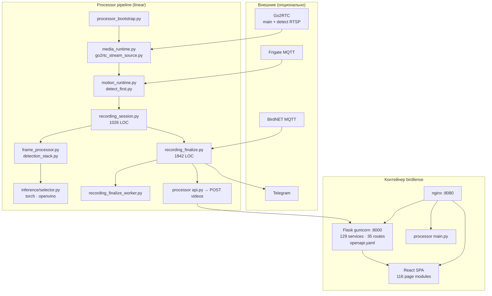
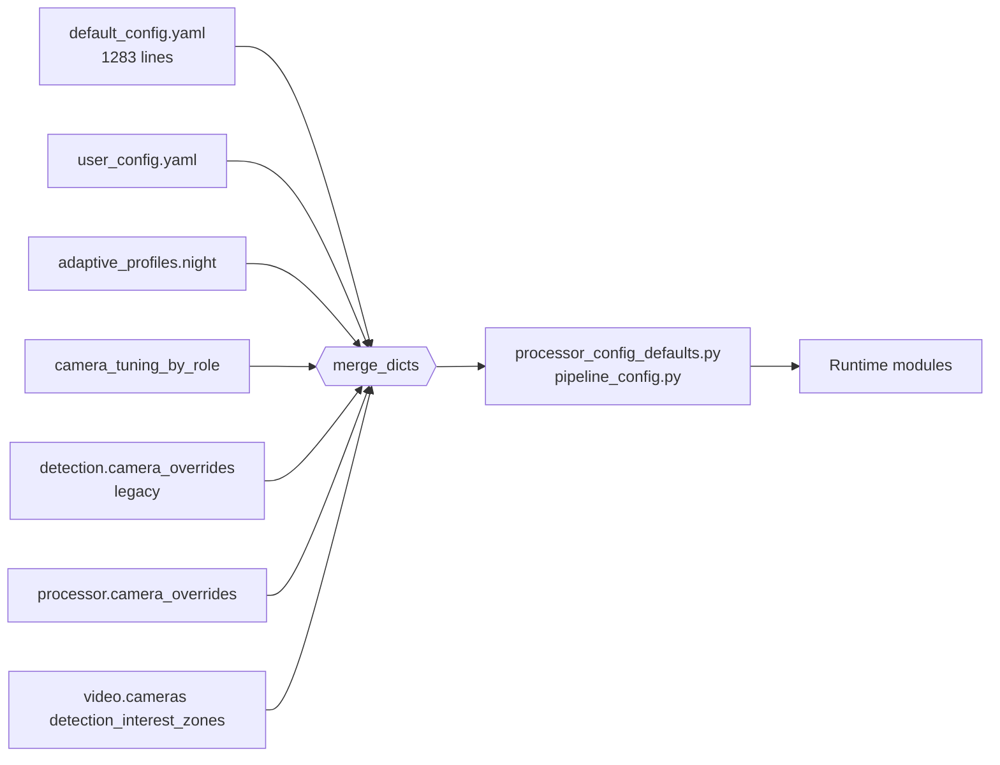

# Предложение по упрощению и оптимизации BirdLense Hub

**Дата:** 2026-06-10  
**Область:** processor, web, ui, config  
**Статус:** research / proposal (без изменений кода)  
**Связано:** `CV_PIPELINE_RECOVERY_PLAN_2026-06.md`, `DUAL_STREAM_BBOX_SYNC_PLAN_2026-06.md`, `review_report.md`

---

## 1. Executive summary

BirdLense Hub — зрелый монолит (один Docker-контейнер: nginx + Flask + processor + опционально MCP) с **~120 Python-модулями процессора**, **129 web-сервисами**, **OpenAPI ~5784 строк**, **default_config ~1283 строк**. Продуктовый контракт уже сформулирован: **standalone-first**, **linear pipeline**, **track-first persist**, **dual-stream detect/main** по образцу Frigate.

**Главная проблема сложности** — не отсутствие архитектуры, а **наложение legacy-слоёв** (fusion/salvage/Frigate standalone, `pipeline_mode: legacy`, сотни config-ключей) поверх нового linear-контура, плюс **крупные god-модули** (`recording_finalize.py` ~1842 LOC, `recording_session.py` ~1026 LOC) и **разрозненный UI HTTP-слой**.

**Главный perf-бottleneck** (поле, 24h window): `finalize_duration_ms` p95 **37.3 s**, хвост **77% persist** — не inference и не create_video (`docs/reports/perf/runtime_pipeline_profile_latest.md`).

**Рекомендуемая стратегия:** не «упрощать всё», а **сжать поверхность** — удалить мёртвые ветки, декомпозировать finalize, унифицировать клиент/UI-config tiers, сохранить dual-stream и опциональные интеграции как thin adapters.

**Ожидаемый эффект за 2–3 фазы (8–12 нед):**
- −30–40% cognitive load для contributor (меньше config/legacy paths)
- p95 finalize → <8 s (цель из runtime profile warnings)
- единый HTTP/error contract в UI
- меньше «тихих» сбоев (узкие except + typed services)

---

## 2. Карта сложности

### 2.1. Mermaid — runtime contours

### 2.2. Mermaid — config merge layers

### 2.3. Hotspots (метрики из репозитория)

| Зона | Файлы / масштаб | Риск |
|------|-----------------|------|
| Finalize | `recording_finalize.py`, `fusion_model.py`, `finalize_classification.py`, `birdnet_fifo_persist.py` | p95 37s; 21× `except Exception` только в finalize |
| Session loop | `recording_session.py`, `frame_processor.py`, `detect_first.py` | 13× broad except; concurrency без единого lock policy |
| Stream ingest | `go2rtc_stream_source.py` (941 LOC), `dual_stream_timeline.py`, `frame_geometry.py` | dual-stream desync; 10× broad except |
| Web services | `app/web/services/*.py` (129 файлов) | дубли helpers, тонкие wrappers |
| UI settings | `app/ui/src/pages/Settings/` (43 файла) | экспонирует ~200+ processor keys |
| Config | `default_config.yaml`, `config_schema.py` | legacy keys «на всякий случай» |
| Legacy pipeline | `pipeline_mode_utils.py`, `linear_pipeline.py`, `detection_quality.py` | двойные decision paths |

---

## 3. Top 10 оптимизаций

Оценка: **Impact** (1–5), **Effort** (1–5, выше = дороже). **Priority** = Impact / Effort (грубо).

| # | Оптимизация | Impact | Effort | Priority | Ключевые файлы |
|---|-------------|--------|--------|----------|----------------|
| 1 | **Декомпозиция finalize** на подмодули: classify, fusion-trim, persist, notify, metrics | 5 | 4 | ★★★★ | `recording_finalize.py` → `recording_finalize_*.py`, worker без изменения API |
| 2 | **Удаление `pipeline_mode: legacy`** и связанных веток после migration window | 4 | 3 | ★★★★ | `pipeline_mode_utils.py`, `linear_pipeline.py`, `detection_quality.py`, `default_config.yaml` |
| 3 | **Finalize perf: профилирование persist tail** (Birder crops, fusion, birdnet fifo, dataset_crops) + lazy/off по profile | 5 | 3 | ★★★★★ | `finalize_classification.py`, `detection_fusion.py`, `recording_dataset_crops.py`, `birdnet_fifo_persist.py` |
| 4 | **Единый UI HTTP client** (`csrfFetch` + typed errors) вместо fetch/axios mix | 3 | 2 | ★★★★ | `app/ui/src/api/client.ts`, `timeline.ts`, `dataset.ts`, `labelling.ts`, `favorites.ts`, `birdFoodFeed.ts` |
| 5 | **Config tiers в UI**: Basic / Advanced / Expert; скрыть legacy keys | 4 | 3 | ★★★ | `Settings/sections/processor/*`, `cameraTuningFields.ts`, `default_config.yaml` (mark deprecated) |
| 6 | **Сузить `except Exception`** в P0 hot paths с re-raise OOM/IO | 4 | 3 | ★★★ | `recording_finalize.py`, `recording_session.py`, `go2rtc_stream_source.py`, `mqtt_aggregator.py` (~186 total) |
| 7 | **DRY web ingest**: один service facade для processor → DB (videos, detections, funnel) | 3 | 3 | ★★★ | `processor_routes.py`, `persist_funnel_service.py`, `reconcile_recordings_service.py` |
| 8 | **OpenVINO contract hardening**: validate IR path at bootstrap, auto→torch fallback с metric | 4 | 2 | ★★★★ | `inference/selector.py`, `detection_stack.py`, `processor_bootstrap.py`, deploy Intel override |
| 9 | **go2rtc ingest simplification**: один RTSP read + shared clock (уже частично в тестах) | 4 | 4 | ★★★ | `go2rtc_stream_source.py`, `media_runtime.py`, `test_go2rtc_single_rtsp_read.py` |
| 10 | **Static typing baseline** (mypy/pyright) для processor+web services | 3 | 4 | ★★ | `recording_session.py`, `detection_strategy.py`, `app/web/services/*` |

---

## 4. DRY targets

### 4.1. Processor

| Дублирование | Сейчас | Цель |
|--------------|--------|------|
| Detection stack assembly | Уже централизовано в `detection_stack.py` (#223) | Расширить на offline tools (`track_regenerator.py`, scripts) |
| Config defaults | `processor_config_defaults.py` + разброс в модулях | Единый `config_float()` / guard; grep «magic numbers» → 0 в hot paths |
| Geometry remap | `frame_geometry.py`, `yolo_geometry.py`, `playback_geometry.py` | Один «playback frame of reference» API (см. dual-stream plan) |
| Fusion vs linear | `fusion_model.py`, `hypothesis_arbitration.py`, `weighted_species_arbiter.py` | Linear: только species vote на finalize; fusion — adapter для BirdNET hint |
| Notify preview | `notify_preview_encode.py`, `record_hires_crop.py`, `recording_notify_*.py` | Chain `auto → hires → lores` в одном policy module |
| MQTT parsers | `mqtt_event_parsers.py`, `motion_detectors/frigate_mqtt.py` | Registry pattern (уже частично `trigger_graph.py`) |

### 4.2. Web

| Дублирование | Файлы | Цель |
|--------------|-------|------|
| Timeline payload build | `ui_timeline_helpers.py`, `timeline_payloads.py` | Один builder + OpenAPI schema reuse |
| System diagnostics | `system_diagnostics_service.py`, `readiness_service.py`, `component_status_service.py` | Composite «health dashboard» facade |
| Settings R/W | `ui_settings_routes.py`, YAML merge в web | Pydantic models из `config_schema.py` end-to-end |
| Strict auth checks | `strict_ui_api_auth_service.py` + per-route | Middleware/decorator only |

### 4.3. UI

| Дублирование | Файлы | Цель |
|--------------|-------|------|
| API transport | `client.ts` vs raw fetch vs axios | `apiFetch<T>()` единственная точка |
| Settings field grids | `CameraTuningFieldsGrid.tsx`, `Processor*Block.tsx` | Schema-driven form из OpenAPI/config JSON Schema |
| Query keys | `queryKeys.ts` + inline | Centralized per domain |

---

## 5. Performance

### 5.1. Наблюдаемые bottlenecks

Источник: `docs/reports/perf/runtime_pipeline_profile_latest.md` (2026-06-03, n=47 sessions).

| Стадия | p50 | p95 | Комментарий |
|--------|-----|-----|-------------|
| trigger→first_bbox | 0.94 s | 5.46 s | KPI warn 8s — на грани |
| finalize_total | 1.87 s | **37.3 s** | **Dominant problem** |
| fusion | 322 ms | 1.46 s | иногда хвост до 37s (coupled) |
| persist | 456 ms | **28.6 s** | 77% critical path |
| create_video | 33 ms | 98 ms | OK |

### 5.2. Рекомендации

1. **Finalize worker tuning** — `recording_finalize_worker.py` уже decouple; проверить `maxsize`, backpressure metrics (`processor_backpressure.py`), не блокировать session loop.
2. **Defer expensive work** — `recording_dataset_crops.py`, `roi_super_resolution.py`, behavior/reid — только при явном profile flag.
3. **Classifier batching** — `classifier_defer_to_finalize: true` уже есть; ограничить `classifier_finalize_max_key_frames` (default 3) на feeder profile.
4. **OpenVINO** — явный `inference_backend: openvino`, `inference_device: intel:gpu`; IR 640 под BRG; `/dev/dri` override при deploy (`scripts/docker-compose-intel-override-gen.sh`). Frigate pattern: GPU/NPU для detect, CPU decode отдельно ([Frigate Object Detectors](https://docs.frigate.video/configuration/object_detectors/)).
5. **go2rtc restream** — detect substream для inference, main для record ([Frigate go2rtc guide](https://docs.frigate.video/guides/configuring_go2rtc/)); Hub уже так, но выигрыш — **меньше FFmpeg процессов** (single read path).
6. **Stream probe cache** — `stream_probe.py` + `encoding_status.py` — не re-probe каждую сессию.

### 5.3. Целевые SLO (предложение)

| Метрика | Сейчас p95 | Target |
|---------|------------|--------|
| finalize_duration_ms | 37343 | <8000 |
| trigger_to_first_bbox_wall_s | 5.46 | <5.0 |
| yolo_frames_with_tracks / yolo_frames_ran | field-dependent | ≥0.15 (из CV recovery plan) |
| create_video_p95_ms | 98 | <300 (запас) |

---

## 6. Reliability

### 6.1. Наблюдения

- **~186× `except Exception`** в processor (`review_report.md`) — маскирует OOM, RTSP drop, OpenVINO init fail.
- **Readiness/funnel** уже есть: `readiness_service.py`, `persist_funnel_service.py`, `yolo_blind_monitor.py`.
- **Config drift gate** зелёный (`processor_config_drift_latest.md`: drift_count=0).
- **Dual-stream geometry** — активный EPIC (#606–#611); метрика `bbox_remap_mismatch_total`.

### 6.2. Рекомендации

| Область | Действие | Файлы |
|---------|----------|-------|
| Error taxonomy | `reject_reason_code` everywhere + narrow except | `decision_outcome.py`, `recording_post_fusion_rejections.py` |
| Stream resilience | Reconnect + exponential backoff для RTSP | `go2rtc_stream_source.py`, `media_runtime.py` |
| OpenVINO fail-fast | Bootstrap validate + fallback torch + counter | `detection_stack.py`, `inference/selector.py` |
| Finalize idempotency | Manifest + rollback (частично) | `recording_session_manifest.py`, `test_recording_finalize_rollback.py` |
| Prod gates | Уже: `verify-prod-env.sh`, strict auth | `app/web/config.py`, CI job |
| Observability | Structured JSON logs (optional flag) | `app/web/app_logging.py` |

---

## 7. Phased roadmap

### Phase 0 — Measure & guard (1–2 нед, низкий риск)

- [ ] Baseline: `make ci-local`, runtime profile export, persist funnel snapshot
- [ ] Документировать «config tiers» (basic/advanced) без UI change
- [ ] Audit: список legacy keys с `runtime may ignore` в `default_config.yaml`

**Exit:** dashboard в readiness с finalize breakdown by stage.

### Phase 1 — Safe simplification (2–4 нед)

- [ ] UI HTTP unification (`client.ts` migration, 5–8 файлов)
- [ ] OpenVINO bootstrap validation + metrics
- [ ] Narrow except в top-4 processor files
- [ ] Mark deprecated config keys; prod profile YAML example

**Exit:** нет регрессии CI; axios только через wrapper или удалён.

### Phase 2 — Pipeline surface reduction (4–6 нед)

- [ ] Split `recording_finalize.py` (behavior-preserving)
- [ ] Remove `pipeline_mode: legacy` code paths + migration note
- [ ] Linear-only fusion trim (BirdNET/Frigate as hints)
- [ ] Settings UI: hide expert blocks by default

**Exit:** `pipeline_mode` только `linear`; finalize modules <400 LOC each.

### Phase 3 — Performance & stream (4–6 нед)

- [ ] Finalize persist tail profiling + lazy features
- [ ] go2rtc single-read PoC → production behind flag
- [ ] Dual-stream Phase E/F completion (geometry parity)
- [ ] mypy baseline (web services + processor public APIs)

**Exit:** finalize p95 <8s на prod profile; IoU median ↑ на golden clips.

### Phase 4 — Optional consolidation (backlog)

- [ ] Web services merge (129 → ~80 facades)
- [ ] Schema-driven Settings forms
- [ ] Structured logging / OTel

---

## 8. Что НЕ упрощать

| Capability | Почему | Ключевые модули |
|------------|--------|-----------------|
| **Dual-stream detect/main** | Frigate-grade pattern: lores для YOLO/motion, main для MP4; экономит CPU и даёт качество записи | `media_runtime.py`, `go2rtc_stream_source.py`, `dual_stream_timeline.py`, `inference_lores.py` |
| **Detect-first anchor** | Снижает пустые записи без YOLO | `detect_first.py`, `recording_session.py` |
| **ByteTrack + dense frames[]** | Track-first invariant, overlay/TG | `frame_processor.py`, `dense_track_persist.py`, `bytetrack_contract.py` |
| **Playback geometry remap** | Единственный способ согласовать lores bbox и 1080p overlay | `frame_geometry.py`, `playback_geometry.py`, `yolo_geometry.py` |
| **Linear pipeline stages** | Чёткий продуктовый контракт standalone-first | `linear_pipeline.py`, `object_confirm.py`, `persist_mode.py` |
| **Опциональные интegrations** | Frigate/BirdNET как **hint**, не автор persist | `frigate_scope.py`, `mqtt_aggregator.py`, `birdnet_mqtt_confidence.py` |
| **OpenAPI as source of truth** | UI codegen, MCP, contract tests | `app/web/openapi.yaml`, `app/ui/src/generated/openapi-types.ts` |
| **Separate finalize worker** | Изоляция тяжёлого tail от hot loop | `recording_finalize_worker.py` |
| **Per-camera tuning** | Разные кормушки/роли | `camera_tuning_by_role`, `video.cameras[].tuning_role`, Settings blocks |
| **Production security gates** | Non-negotiable | `strict_ui_api_auth_service.py`, `verify-prod-env.sh` |

**Anti-pattern:** «один RTSP для всего» или «Frigate bbox как persist» — ломает prod BirdBox и противоречит `docs/strategy/DUAL_STREAM_BBOX_SYNC_PLAN_2026-06.md`.

---

## 9. Паттерны Frigate / go2rtc / OpenVINO (web research)

### 9.1. Frigate + go2rtc

- **go2rtc restream** снижает число прямых подключений к камере; detect и record roles мапятся на `rtsp://127.0.0.1:8554/<camera>` ([Configuring go2rtc](https://docs.frigate.video/guides/configuring_go2rtc/)).
- **Dual resolution:** substream (detect, ~5 fps, 720p) + main (record) — стандарт; aspect ratio detect ≈ record чтобы избежать UI resize ([Live View](https://docs.frigate.video/configuration/live/)).
- **Live view tiers:** jsmpeg (detect-limited) vs MSE/WebRTC через go2rtc — Hub аналог: MJPEG `/processor/live` + go2rtc proxy в nginx.
- **Риск:** go2rtc restream иногда медленнее direct RTSP (5–15s load) — нужен fallback и health ([Discussion #19351](https://github.com/blakeblackshear/frigate/discussions/19351)).

**Применимость к Hub:** уже близко; оптимизация — **single consumer + timeline sync**, не отказ от dual-stream.

### 9.2. OpenVINO на edge

- Frigate: `type: openvino`, `device: GPU|NPU|CPU`; **model path обязателен** ([Object Detectors](https://docs.frigate.video/configuration/object_detectors/)).
- NPU для detect + GPU для enrichments на Core Ultra ([Discussion #13248](https://github.com/blakeblackshear/frigate/discussions/13248)).
- Модели 320×320 быстрее 640×640; Hub BRG export 640 — tradeoff accuracy/latency ([High CPU Usage](https://docs.frigate.video/troubleshooting/cpu/)).
- «CPU usage» в UI Frigate часто = decode/preprocess, не failed GPU inference.

**Применимость к Hub:** `inference/selector.py`, `openvino_binary_enabled()`, deploy override; усилить **path validation** (типичный prod fail — пустой IR path, см. [Discussion #18985](https://github.com/blakeblackshear/frigate/discussions/18985)).

### 9.3. Motion-before-detect

Frigate: motion → regions → detector. Hub: OpenCV/mqtt triggers + **detect-first YOLO probe** — строже, aligned с track-first.

---

## 10. References

### Внутренние

| Документ | Путь |
|----------|------|
| Architecture (RU) | `docs/ru/architecture.ru.md` |
| Processor README | `app/processor/src/README.md` |
| CV Pipeline Recovery | `docs/strategy/CV_PIPELINE_RECOVERY_PLAN_2026-06.md` |
| Dual-stream plan | `docs/strategy/DUAL_STREAM_BBOX_SYNC_PLAN_2026-06.md` |
| Runtime perf profile | `docs/reports/perf/runtime_pipeline_profile_latest.md` |
| ML debt scorecard | `docs/reports/ml_debt/ml_technical_debt_scorecard_latest.md` |
| Code review snapshot | `review_report.md` |
| Deploy / Intel GPU | `.cursor/rules/deploy.mdc` |
| Agent instructions | `AGENTS.md` |

### Ключевые файлы по слоям

| Слой | Anchor files |
|------|--------------|
| Bootstrap / loop | `app/processor/src/main.py`, `processor_bootstrap.py` |
| Stream | `media_runtime.py`, `sources/go2rtc_stream_source.py`, `stream_probe.py` |
| Detection | `detection_stack.py`, `frame_processor.py`, `detection_strategy.py` |
| Inference | `inference/selector.py`, `inference_lores.py`, `pipeline_config.py` |
| Recording | `recording_session.py`, `recording_finalize.py`, `recording_finalize_worker.py` |
| Geometry | `frame_geometry.py`, `dual_stream_timeline.py`, `playback_geometry.py` |
| Web API | `app/web/openapi.yaml`, `routes/processor_routes.py`, `services/readiness_service.py` |
| UI | `app/ui/src/App.tsx`, `api/client.ts`, `pages/Settings/` |
| Config | `app/app_config/default_config.yaml`, `config_schema.py`, `user_config.yaml` |

### Внешние

- [Frigate — Configuring go2rtc](https://docs.frigate.video/guides/configuring_go2rtc/)
- [Frigate — Live View](https://docs.frigate.video/configuration/live/)
- [Frigate — Object Detectors / OpenVINO](https://docs.frigate.video/configuration/object_detectors/)
- [Frigate — High CPU Usage](https://docs.frigate.video/troubleshooting/cpu/)
- [go2rtc instability discussion](https://github.com/blakeblackshear/frigate/discussions/19351)
- [OpenVINO NPU on Frigate](https://github.com/blakeblackshear/frigate/discussions/13248)

---

*Документ подготовлен по состоянию репозитория 2026-06-10. Не заменяет execution plans #606–#612; дополняет их системным взглядом на упрощение.*
